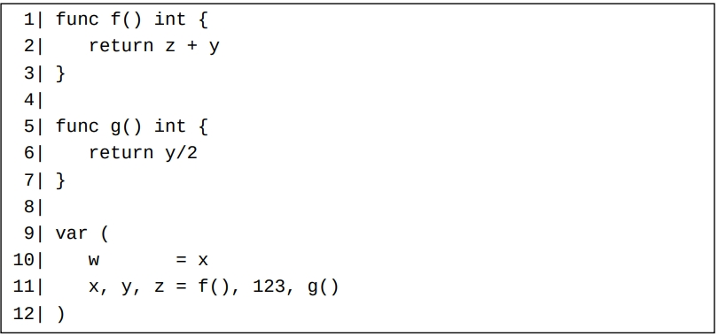

当一个代码包被引入一个Go源文件时，只有此代码包中的导出（第5章）代码要素（名称为大写字母的变量、常量、函数、定义类型和类型别名等）可以在此源文件被使用。
一个包引入也可称为一个包声明。一个包声明只在当前包含此声明的源文件内可见。

#更多关于fmt.Printf函数调用的输出格式

- %v：将被替换为对应实参字符串表示形式。
- %T：将替换为对应实参的类型的字符串表示形式。
- %x：将替换为对应实参的十六进制表示。实参的类型可以为字符串、整数、整数数组（array）或者整数切片（slice）等。 （数组和切片将在以后的文章中讲解。）
%s：将被替换为对应实参的字符串表示形式。实参的类型必须为字符串或者
- 字节切片（byte slice）类型。
- %%：将被替换为一个百分号。

#代码包目录、代码包引入路径和代码包依赖关系

一个代码包可以由若干Go源文件组成。一个代码包的源文件须都处于同一个目录下。一个目录（不包含子目录）下的所有源文件必须都处于同一个代码包中，亦即这些源文件开头的package pkgname语句必须一致。 所以，一个代码包对应着一个目录（不包含子目录），反之亦然。 对应着一个代码包的目录称为此代码包的目录。 一个代码包目录下的每个子目录对应的都是另外一个独立的代码包。

当一个代码包中的某个文件引入了另外一个代码包，则我们说前者代码包依赖于后
者代码包。

Go不支持循环引用（依赖）。 如果一个代码包a依赖于代码包b，同时代码包b依赖于代码包c，则代码包c中的源文件不能引入代码包a和代码包b，代码包b中的源文件也不能引入代码包a。

#init函数
在一个代码包中，甚至一个源文件中，可以声明若干名为init的函数。 这些init函数必须不带任何输入参数和返回结果。

注意：我们不能声明名为init的包级变量、常量或者类型。

在程序运行时刻，在进入main入口函数之前，每个init函数在此包加载的时候将被（串行）执行并且只执行一遍。

#程序代码要素初始化顺序
一个程序中所涉及到的所有的在运行时刻要用到的代码包的加载是串行执行的。 在一个程序启动时，每个包中总是在它所有依赖的包都加载完成之后才开始加载。 程序代码包总是最后一个被加载的代码包。每个被用到的包会被而且仅会被加载一次。

在加载一个代码包的过程中，所有的声明在此包中的init函数将被串行调用并且仅调用执行一次。 一个代码包中声明的init函数的调用肯定晚于此代码包所依赖的代码包中声明的init函数。 所有的init函数都将在调用main入口函数之前被调用执行。

在同一个源文件中声明的init函数将按从上到下的顺序被调用执行。 对于声明在同一个包中的两个不同源文件中的两个init函数，Go语言白皮书推荐（但不强求）按照它们所处于的源文件的名称的词典序列（对英文来说，即字母顺序）来调用。所以最好不要让声明在同一个包中的两个不同源文件中的两个init函数存在依赖关系。

在加载一个代码包的时候，此代码包中声明的所有包级变量都将在此包中的任何一个init函数执行之前初始化完毕。

在同一个包内，包级变量将尽量按照它们在代码中的出现顺序被初始化，但是一个包级变量的初始化肯定晚于它所依赖的其它包级变量。 比如，在下面的代码片段中，四个包级变量的初始化顺序依次为y、z、x、w。

#完整的引入声明语句形式

事实上，一个引入声明语句的完整形式为：

其中引入名importname是可选的，它的默认值为被引入的包的包名（不是目录名）。

事实上，在本文上面的例子中的包引入声明中，importname部分都被省略掉了，因为它们都分别和引入的代码包的包名相同。

一个完整引入声明语句形式的引入名importname可以是一个句点(.)。 这样的引入称为**句点引入**。使用被句点引入的包中的导出代码要素时，限定标识符的前缀必须省略。

一个完整引入声明语句形式的引入名importname可以是一个空标识符(_)。 这样的引入称为**匿名引入**。一个包被匿名引入的目的主要是为了加载这个包，从而使得这个包中的代码要素得以初始化。 被匿名引入的包中的init函数将被执行并且仅执行一遍。

**每个非匿名引入必须至少被使用一次**