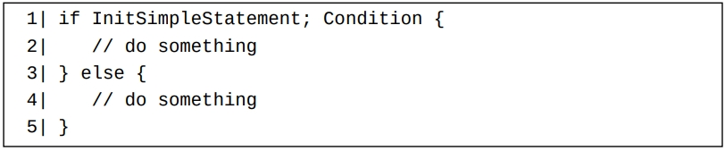
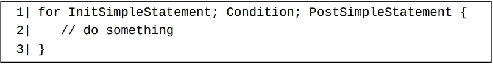
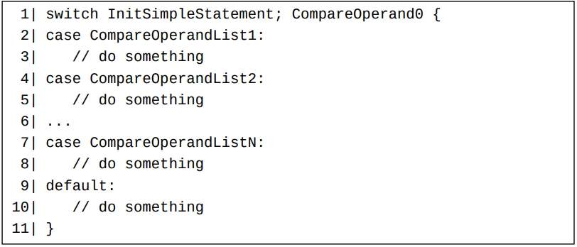

#Go中的流程控制语句简单介绍

Go语言中有三种基本的流程控制代码块：
- if-else条件分支代码块；
- for循环代码块；
- switch-case多条件分支代码块。

Go中另外还有几种和特定种类的类型相关的流程控制代码块：
- 容器类型（第18章）相关的for-range循环代码块。
- 接口类型（第23章）相关的type-switch多条件分支代码块。
- 通道类型（第21章）相关的select-case多分支代码块。

#if-else条件分支控制代码块

if和else是两个关键字。 和很多其它编程语言一样，else分支是可选的。在一个if-else条件分支控制代码块中，
- InitSimpleStatement部分是可选的，如果它没被省略掉，则它必须为一条简单语句（第11章）。 如果它被省略掉，它可以被视为一条空语句（简单语句的一种）。 在实际编程中，InitSimpleStatement常常为一条变量短声明语句。
- Condition必须为一个结果为布尔值的表达式（第11章）（它被称为条件表达式）。 Condition部分可以用一对小括号括起来，但大多数情况下不需要。

注意，我们不能用一对小括号将InitSimpleStatement和Condition两部分括在一起。

#for循环代码块

其中for是一个关键字。

在一个for循环代码块中，

- InitSimpleStatement（初始化语句）和PostSimpleStatement（步尾语句）两个部分必须均为简单语句，并且PostSimpleStatement不能为一个变量短声明语句。
- Condition必须为一个结果为布尔值的表达式（它被称为条件表达式）。

#switch-case流程控制代码块

其中switch、case和default是三个关键字。
在一个switch-case流程控制代码块中，
- InitSimpleStatement部分必须为一条简单语句，它是可选的。
- CompareOperand0部分必须为一个表达式（如果它没被省略的话，见下）。此表达式的估值结果总是被视为一个类型确定值。如果它是一个类型不确定值，则它被视为类型为它的默认类型的类型确定值。 因为这个原因，此表达式不能为类型不确定的nil值。 
- CompareOperand0常被称为switch表达式。每个CompareOperandListX部分（X表示1到N）必须为一个用（英文）逗号分隔开来的表达式列表。 其中每个表达式都必须能和CompareOperand0表达式进行比较。 每个这样的表达式常被称为case表达式。 如果其中case表达式是一个类型不确定值，则它必须能够自动隐式转化为对应的switch表达式的类型，否则编译将失败。

#goto跳转语句和跳转标签声明
在一个goto跳转语句中，goto关键字后必须跟随一个表明跳转到何处的跳转标签。 我们使用LabelName:这样的形式来声明一个名为LabelName的跳转标签，其中LabelName必须为一个标识符。一个不为空标识符的跳转标签声明后必须被使用至少一次。
