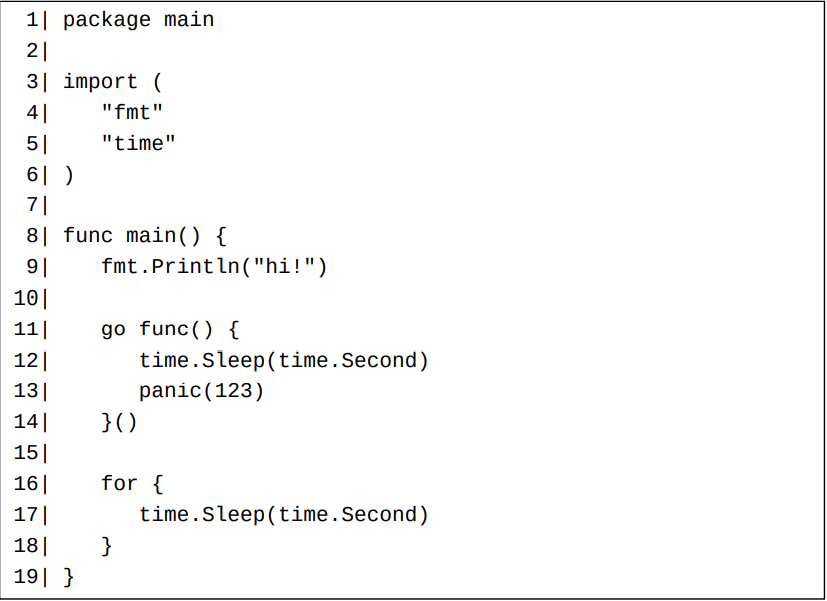

# 协程（goroutine）

并发计算是指若干计算可能在某些时间片段内同时运行的情形。 下面这两张图描绘了两种并发计算的场景。在此图中，A和B表示两个计算。 在第一种情形中，两个计算只在某些时间片段同时运行。 第二种情形称为并行（parallel）计算。在并行计算中，多个计算在任何时间点都在同时运行。并行计算属于特殊的并发计算。

在Go编程中，协程是创建计算的唯一途径。

协程有时也被称为绿色线程。绿色线程是由程序的运行时（runtime）维护的线程。一个绿色线程的内存开销和情景转换（context switching）时耗比一个系统线程常常小得多。 只要内存充足，一个程序可以轻松支持上万个并发协程。

Go不支持创建系统线程，所以协程是一个Go程序内部唯一的并发实现方式。

每个Go程序启动的时候只有一个对用户可见的协程，我们称之为主协程。 一个协程可以开启更多其它新的协程。在Go中，开启一个新的协程是非常简单的。 我们只需在一个函数调用之前使用一个go关键字，即可让此函数调用运行在一个新的协程之中。 当此函数调用退出后，这个新的协程也随之结束了。我们可以称此函数调用为一个协程调用（或者为此协程的启动调用）。 一个协程调用的所有返回值（如果存在的话）必须被全部舍弃。

当一个程序的主协程退出后，此程序也就退出了，即使还有一些其它协程在运行。

# 并发同步（concurrency synchronization）

不同的并发计算可能共享一些资源，其中共享内存资源最为常见。 在一个并发程序中，常常会发生下面的情形：

   - 在一个计算向一段内存写数据的时候，另一个计算从此内存段读数据，结果导致读出的数据的完整性得不到保证。
   - 在一个计算向一段内存写数据的时候，另一个计算也向此段内存写数据，结果导致被写入的数据的完整性得不到保证。

这些情形被称为数据竞争（data race）。并发编程的一大任务就是要调度不同计算，控制它们对资源的访问时段，以使数据竞争的情况不会发生。 此任务常称为并发同步（或者数据同步）。Go支持几种并发同步技术，这些并发同步技术将在后面的章节中逐一介绍。

并发编程中的其它任务包括：

   - 决定需要开启多少计算；
   - 决定何时开启、阻塞、解除阻塞和结束哪些计算；
   - 决定如何在不同的计算中分担工作负载。

Go支持几种并发同步技术（第36章）。 其中， 通道（第21章）是最独特和最常用的。 但是，为了简单起见，这里我们将使用sync标准库包中的WaitGroup来同步上面这个程序中的主协程和两个新创建的协程。

WaitGroup类型有三个方法（特殊的函数，将在以后的文章中详解）：Add、Done和Wait。 此类型将在后面的某篇文章中详细解释，目前我们可以简单地认为：

   - Add方法用来注册新的需要完成的任务数。
   - Done方法用来通知某个任务已经完成了。
   - 一个Wait方法调用将阻塞（等待）到所有任务都已经完成之后才继续执行其后的语句。

# 协程的状态

从上面这个的例子，我们可以看到一个活动中的协程可以处于两个状态：运行状态和阻塞状态。一个协程可以在这两个状态之间切换。 比如上例中的主协程在调用wg.Wait方法的时候，将从运行状态切换到阻塞状态；当两个新协程完成各自的任务后，主协程将从阻塞状态切换回运行状态。

下面的图片显示了一个协程的生命周期。

**注意，一个处于睡眠中的（通过调用time.Sleep）或者在等待系统调用返回的协程被认为是处于运行状态，而不是阻塞状态。**

当一个新协程被创建的时候，它将自动进入运行状态，一个协程只能从运行状态而不能从阻塞状态退出。 如果因为某种原因而导致某个协程一直处于阻塞状态，则此协程将永远不会退出。 除了极个别的应用场景，在编程时我们应该尽量避免出现这样的情形。

一个处于阻塞状态的协程不会自发结束阻塞状态，它必须被另外一个协程通过某种并发同步方法来被动地结束阻塞状态。 如果一个运行中的程序当前所有的协程都出于阻塞状态，则这些协程将永远阻塞下去，程序将被视为死锁了。 当一个程序死锁后，官方标准编译器的处理是让这个程序崩溃。

比如下面这个程序将在运行两秒钟后崩溃。

# 协程的调度

并非所有处于运行状态的协程都在执行。在任一时刻，只能最多有和逻辑CPU数目一样多的协程在同时执行。 我们可以调用runtime.NumCPU函数来查询当前程序可利用的逻辑CPU数目。 **每个逻辑CPU在同一时刻只能最多执行一个协程。**Go运行时（runtime）必须让逻辑CPU频繁地在不同的处于运行状态的协程之间切换，从而每个处于运行状态的协程都有机会得到执行。 这和操作系统执行系统线程的原理是一样的。

下面这张图显示了一个协程的更详细的生命周期。在此图中，运行状态被细分成了多个子状态。 一个处于排队子状态的协程等待着进入执行子状态。一个处于执行子状态的协程在被执行一会儿（非常短的时间片）之后将进入排队子状态。

标准编译器采纳了一种被称为M-P-G模型（https://docs.google.com/document/d/1TTj4T2JO42uD5ID9e89oa0sLKhJYD0Y_kqxDv3I3XMw）的算法来实现协程调度。 其中，M表示系统线程，P表示逻辑处理器（并非上述的逻辑CPU），G表示协程。 大多数的调度工作是通过逻辑处理器（P）来完成的。 逻辑处理器像一个监工一样通过将不同的处于运行状态协程（G）交给不同的系统线程（M）来执行。 一个协程在同一时刻只能在一个系统线程中执行。一个执行中的协程运行片刻后将自发地脱离让出一个系统线程，从而使得其它处于等待子状态的协程得到执行机会。

在运行时刻，我们可以调用runtime.GOMAXPROCS（https://golang.google.cn/pkg/runtime/#GOMAXPROCS）函数来获取和设置逻辑处理器的数量。 对于官方标准编译器，在Go 1.5之前，默认初始逻辑处理器的数量
为1；自从Go 1.5之后，默认初始逻辑处理器的数量和逻辑CPU的数量一致。 此新的默认设置在大多数情况下是最佳选择。但是对于某些文件操作十分频繁的程序，设置一个大于runtime.NumCPU()的GOMAXPROCS值可能是有好处的。

我们也可以通过设置GOMAXPROCS环境变量来设置一个Go程序的初始逻辑处理器数量。

# 延迟函数调用（deferred function call）

在Go中，一个函数调用可以跟在一个defer关键字后面，成为一个延迟函数调用。此defer关键字和此延迟函数调用一起形成一个延迟调用语句。 和协程调用类似，**被延迟的函数调用的所有返回值（如果存在）必须全部被舍弃**。

当一个延迟调用语句被执行时，其中的延迟函数调用不会立即被执行，而是被推入由**当前协程维护的一个延迟调用队列**。 当一个函数调用返回（此时可能尚未完全退出）并进入它的退出阶段（第9章）后，所有在执行此函数调用的过程中已经被推入延迟调用队列的调用将被按照它们被推入的顺序逆序被弹出队列并执行。 当所有这些延迟调用执行完毕后，此函数调用也就完全退出了。

# 一个延迟调用可以修改包含此延迟调用的最内层函数的返回值

一个例子：

# 协程和延迟调用的实参的估值时刻

**一个延迟调用的实参是在此调用对应的延迟调用语句被执行时被估值的。** 或者说，它们是在此延迟调用被推入延迟调用队列时被估值的。 这些被估值的结果将在以后此延迟调用被执行的时候使用。

**一个匿名函数体内的表达式是在此函数被执行的时候才会被逐渐估值的，不管此函数是被普通调用还是延迟/协程调用。**

一个例子：

运行之，将得到如下结果：

# 恐慌（panic）和恢复（recover）

Go不支持异常抛出和捕获，而是推荐使用返回值显式返回错误。 不过，Go支持一套和异常抛出/捕获类似的机制。此机制称为恐慌/恢复（panic/recover）机制。

我们可以调用内置函数panic来产生一个恐慌以使当前协程进入恐慌状况。

**进入恐慌状况是另一种使当前函数调用开始返回的途径。 一旦一个函数调用产生一个恐慌，此函数调用将立即进入它的退出阶段。**

通过在一个延迟函数调用之中调用内置函数recover，当前协程中的一个恐慌可以被消除，从而使得当前协程重新进入正常状况。

**如果一个协程在恐慌状况下退出，它将使整个程序崩溃。**

一个recover函数的返回值为其所恢复的恐慌在产生时被一个panic函数调用所消费的参数。

下面这个例子展示了如何产生一个恐慌和如何消除一个恐慌。

下面的例子在一个新协程里面产生了一个恐慌，并且此协程在恐慌状况下退出，所以整个程序崩溃了。

运行之，输出如下：

