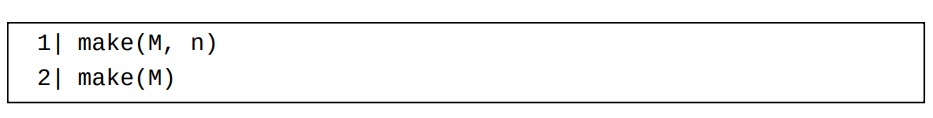
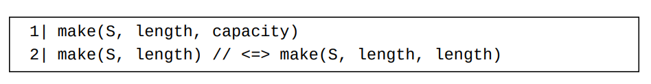

# 第14章：Go类型系统概述
## 类型定义

- 新的类型名必须为标识符。但是请注意：包级类型（以及下一节将要介绍的类型别名）的名称不能为init（第10章）
- 如果一个类型声明包含多于一个的类型描述，这些类型描述必须用一对小括号()括起来。
- 每个类型描述创建了一个全新的定义类型（defined type）。
注意：
1 一个新定义的类型和它的源类型为两个不同的类型。
2 在两个不同的类型定义中所定义的两个类型肯定是两个不同的类型。
3 一个新定义的类型和它的源类型的底层类型（将在下面介绍）一致并且它们的值可以相互显式转换。
4 类型定义可以出现在函数体内。
## 具名类型和无名类型

一个具名类型可能为
- 一个预声明类型；
- 一个定义（非自定义泛型）类型；
- 一个（泛型类型的）实例化类型；
- 一个类型参数类型（使用在自定义泛型中）。

其它类型称为无名类型。一个无名类型肯定是一个组合类型（反之则未必）。

## 类型别名声明

- 类型别名也必须为标识符。同样地，类型别名可以被声明在函数体内。
- 尽管一个类型别名有一个名字，但是它可能表示一个无名类型。 

## 底层类型

- 一个内置类型的底层类型为它自己。
- unsafe标准库包中定义的Pointer类型的底层类型是它自己。 （至少我们
可以认为是这样。事实上，关于unsafe.Pointer类型的底层类型，官方文档
中并没有清晰的说明。我们也可以认为unsafe.Pointer类型的底层类型为
*T，其中T表示一个任意类型。） unsafe.Pointer也被视为一个内置类
型。
- 一个无名类型（必为一个组合类型）的底层类型为它自己。
- 在一个类型声明中，新声明的类型和源类型共享底层类型。

在Go中，
- 底层类型为内置类型bool的类型称为布尔类型；
- 底层类型为任一内置整数类型的类型称为整数类型；
- 底层类型为内置类型float32或者float64的类型称为浮点数类型；
- 底层类型为内置类型complex64或complex128的类型称为复数类型；
- 整数类型、浮点数类型和复数类型统称为数字值类型；
- 底层类型为内置类型string的类型称为字符串类型。

## 事实：可比较类型和不可比较类型

这些类型称为不可比较类型。
    - 切片类型
    - 映射类型
    - 函数类型
    - 任何包含有不可比较类型的字段的结构体类型和任何元素类型为不可比较类型的数组类型。

其它类型称为可比较类型。
映射类型的键值类型必须为可比较类型。

映射相对于数组和切片有两个优点：
1. 映射的键值类型可以是任何可比较类型。
2. 对于大多数元素为零值的情况，使用映射可以节省大量的内存。

# 读取和修改容器的元素

一个容器值v中存储的对应着键值k的元素用语法形式v[k]来表示。 今后我们称v[k]为一个元素索引表达式。

1. 假设v是一个数组或者切片，在v[k]中，
- 如果k是一个常量，则它必须满足上面列出的对出现在组合字面量中的索引的要求（#value-literals）。 另外，如果v是一个数组，则k必须小于此数组的长度。
- 如果k不是一个常量，则它必须为一个整数。 另外它必须为一个非负数并且小于len(v)，否则，在运行时刻将产生一个恐慌。
- 如果v是一个零值切片，则在运行时刻将产生一个恐慌。

2. 假设v是一个映射值，在v[k]中，k的类型必须为（或者可以隐式转换为）v的类型的元素类型。另外，
- 如果k是一个动态类型为不可比较类型的接口值，则v[k]在运行时刻将造成一个恐慌；
- 如果v[k]被用做一个赋值语句中的目标值并且v是一个零值nil映射，则v[k]在运行时刻将造成一个恐慌；
- 如果v[k]用来表示读取映射值v中键值k对应的元素，则它无论如何都不会产生一个恐慌，即使v是一个零值nil映射（假设k的估值没有造成恐慌）；
- 如果v[k]用来表示读取映射值v中键值k对应的元素，并且映射值v中并不含有对应着键值k的条目，则v[k]返回一个此映射值的类型的元素类型的零值。 一般情况下，v[k]被认为是一个单值表达式。但是在一个v[k]被用为唯一源值的赋值语句中，v[k]可以返回一个可选的第二个返回值。 此第二个返回值是一个类型不确定布尔值，用来表示是否有对应着键值k的条目存储在映射值v中。

# 重温一下切片的内部结构

- 当一个切片被用做一个append函数调用中的基础切片，如果添加的元素数量大于此（基础）切片的冗余元素槽位的数量，则一个新的底层内存片段将被开辟出来并用来存放结果切片的元素。 这时，基础切片和结果切片不共享任何底层元素。
- 否则，不会有底层内存片段被开辟出来。这时，基础切片中的所有元素也同时属于结果切片。两个切片的元素都存放于同一个内存片段上。

# 使用内置make函数来创建切片和映射

假设M是一个映射类型并且n是一个整数，我们可以用下面的两种函数调用来各自生成一个类型为M的映射值。

第一个函数调用形式创建了一个可以容纳至少n个条目而无需再次开辟内存的空映射值。 第二个函数调用形式创建了一个可以容纳一个小数目的条目而无需再次开辟内存的空映射值。此小数目的值取决于具体编译器实现。
注意：第二个参数n可以为负或者零，这时对应的调用将被视为上述第二种调用形式。

假设S是一个切片类型，length和capacity是两个非负整数，并且length小于等于capacity，我们可以用下面的两种函数调用来各自生成一个类型为S的切片值。length和capacity的类型必须均为整数类型（两者可以不一致）。

第一个函数调用创建了一个长度为length并且容量为capacity的切片。 第二个函数调用创建了一个长度为length并且容量也为length的切片。
使用make函数创建的切片中的所有元素值均被初始化为（结果切片的元素类型的）零值。

# 容器元素的可寻址性

- 如果一个数组是可寻址的，则它的元素也是可寻址的；反之亦然，即如果一个数组是不可寻址的，则它的元素也是不可寻址的。 原因很简单，因为一个数组只含有一个（直接）值部（第17章），并且它的所有元素和此直接值部均承载在同一个内存块（第43章）上。
- 一个切片值的任何元素都是可寻址的，即使此切片本身是不可寻址的。 这是因为一个切片的底层元素总是存储在一个被开辟出来的内存片段（间接值部）上。
- 任何映射元素都是不可寻址的。原因详见此条问答（第51章）。

