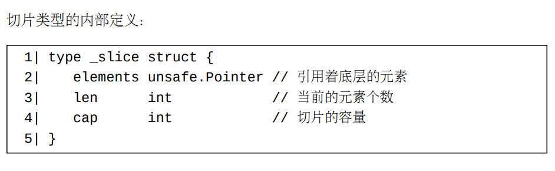

# Go类型分为两大类别
我们称一个Go值分布在不同内存块上的部分为此值的各个值部（value part）。 一个分布在多个内存块上的值含有一个直接值部和若干被此直接值部引用着（第15章）的间接值部。
    
下表将列出这两个类别（category）中的类型（type）种类（kind）：

每个值在内存中只分布在一个内存块上的类型:
- 布尔类型
- 各种数值类型
- 指针类型
- 非类型安全指针类型
- 结构体类型
- 数组类型

每个值在内存中会分布在多个内存块上的类型:

- 切片类型
- 映射类型
- 通道类型
- 函数类型
- 接口类型
- 字符串类型

我们将一个含有（直接或者间接）指针字段的结构体类型称为一个指针包裹类型，将一个含有（直接或者间接）指针的类型称为指针持有者类型。 

# 第二个分类中的类型的（可能的）内部实现结构定义

映射、通道和函数类型的内部定义

切片类型的内部定义

从这个定义可以看出来，一个切片类型在内部可以看作是一个指针包裹类型。 每个非零切片值包含着一个底层间接部分用来存储此切片的元素。 一个切片值的底层元素序列（间接部分）被此切片值的elements字段所引用。

字符串类型的内部结构

从此定义可以看出，每个字符串类型在内部也可以看作是一个指针包裹类型。 每个非零字符串值含有一个指针字段 elements。 这个指针字段引用着此字符串值的底层字节元素序列。

接口类型的内部定义

从这个定义来看，接口类型也可以看作是一个指针包裹类型。一个接口类型含有两个指针字段。 每个非零接口值的（两个）间接部分分别存储着此接口值的动态类型和动态值。 这两个间接部分被此接口值的直接字段dynamicType和dynamicValue所引用。
非空接口类型的内部定义如下：

在赋值中，底层间接值部将不会被复制

在Go中，每个赋值操作（包括函数调用传参等）都是一个值的浅复制过程（假设源值和目标值的类型相同）。 换句话说，在一个赋值操作中，只有源值的直接部分被复制给了目标值。 如果源值含有间接部分，则在此赋值操作完成之后，目标值和源值的直接部分将引用着相同的间接部分。 换句话说，两个值将共享底层的间接值部，如下图所示：

# 关于术语“引用类型”和“引用值”

- 在Go中，只有切片、映射、通道和函数类型属于引用类型。
- 一些函数调用的参数是通过引用来传递的。 （对不起，在Go中，所有的函数调用的参数都是通过值复制直接值部的方式来传递的。）