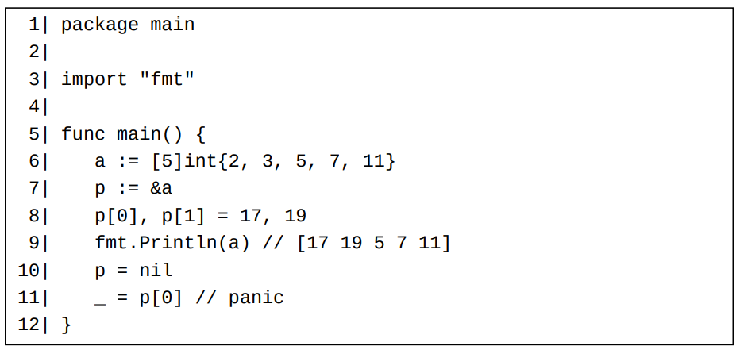
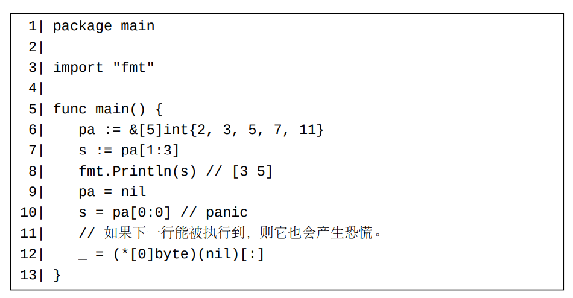

# 容器值的比较

映射和切片类型都属于不可比较类型。 所以任意两个映射值（或切片值）是不能相互比较的。
尽管两个映射值和切片值是不能比较的，但是一个映射值或者切片值可以和预声明的nil标识符进行比较以检查此映射值或者切片值是否为一个零值。
大多数数组类型都是可比较类型，除了元素类型为不可比较类型的数组类型。
当比较两个数组值时，它们的对应元素将按照逐一被比较（可以认为按照下标顺序比较）。这两个数组只有在它们的对应元素都相等的情况下才相等；

# 容器元素的可寻址性
- 如果一个数组是可寻址的，则它的元素也是可寻址的；反之亦然，即如果一个数组是不可寻址的，则它的元素也是不可寻址的。 原因很简单，因为一个数组只含有一个（直接）值部（第17章），并且它的所有元素和此直接值部均承载在同一个内存块上。
- 一个切片值的任何元素都是可寻址的，即使此切片本身是不可寻址的。 这是因为一个切片的底层元素总是存储在一个被开辟出来的内存片段（间接值部）上。
- 任何映射元素都是不可寻址的。

一般来说，一个不可寻址的值的直接部分是不可修改的。但是映射元素是个例外。映射元素虽然不可寻址，但是每个映射元素可以被整个修改（但不能被部分修改）。 对于大多数做为映射元素类型的类型，在修改它们的值的时候，一般体现不出来整个修改和部分修改的差异。 但是如果一个映射的元素类型为数组或者结构体类型，这个差异是很明显的。
- 如果一个映射类型的元素类型为一个结构体类型，则我们无法修改此映射类型的值中的每个结构体元素的单个字段。 我们必须整体地同时修改所有结构体字段。
- 如果一个映射类型的元素类型为一个数组类型，则我们无法修改此映射类型的值中的每个数组元素的单个元素。 我们必须整体地同时修改所有数组元素。

# 从数组或者切片派生切片（取子切片）
我们可以从一个基础切片或者一个可寻址的基础数组派生出另一个切片。此派生操作也常称为一个取子切片操作。 派生出来的切片的元素和基础切片（或者数组）的元素位于同一个内存片段上。或者说，派生出来的切片和基础切片（或者数组）将共享一些元素。

Go中有两种取子切片的语法形式（假设baseContainer是一个切片或者数组）：

    baseContainer[low : high] // 双下标形式
    baseContainer[low : high : max] // 三下标形式
上面所示的双下标形式等价于下面的三下标形式：

    baseContainer[low : high : cap(baseContainer)]

上面所示的取子切片表达式的语法形式中的下标必须满足下列关系，否则代码要么编译不通过，要么在运行时刻将造成恐慌。
    // 双下标形式
    0 <= low <= high <= cap(baseContainer)
    // 三下标形式
    0 <= low <= high <= max <= cap(baseContainer)

不满足上述关系的取子切片表达式要么编译不通过，要么在运行时刻将导致一个恐慌。
注意：
- 只要上述关系均满足，下标low和high都可以大于len(baseContainer)。但是它们一定不能大于cap(baseContainer)。
- 如果baseContainer是一个零值nil切片，只要上面所示的子切片表达式中下标的值均为0，则这两个子切片表达式不会造成恐慌。 在这种情况下，结果切片也是一个nil切片。

在实践中，我们常常在子切片表达式中省略若干下标，以使代码看上去更加简洁。省略规则如下：
- 如果下标low为零，则它可被省略。此条规则同时适用于双下标形式和三下标形式。
- 如果下标high等于len(baseContainer)，则它可被省略。此条规则同时只适用于双下标形式。
- 三下标形式中的下标max在任何情况下都不可被省略。

# 使用内置copy函数来复制切片元素

我们可以使用内置copy函数来将一个切片中的元素复制到另一个切片。 这两个切片的类型可以不同，但是它们的元素类型必须相同。 换句话说，这两个切片的类型的底层类型必须相同。 copy函数的第一个参数为目标切片，第二个参数为源切片。 传递给一个copy函数调用的两个实参可以共享一些底层元素。 copy函数返回复制了多少个元素，此值（int类型）为这两个切片的长度的较小值。

# 遍历容器元素

    for key, element = range aContainer {
        // 使用key和element ...
    }
上面所示的for-range语法形式中的等号=也可以是一个变量短声明符号:=。 当短声明符号被使用的时候，key和element总是两个新声明的变量

遍历一个nil映射或者nil切片是允许的。这样的遍历可以看作是一个空操作。

一些关于遍历映射条目的细节：
- 映射中的条目的遍历顺序是不确定的（可以认为是随机的）。或者说，同一个映射中的条目的两次遍历中，条目的顺序很可能是不一致的，即使在这两次遍历之间，此映射并未发生任何改变。
- 如果在一个映射中的条目的遍历过程中，一个还没有被遍历到的条目被删除了，则此条目保证不会被遍历出来。
- 如果在一个映射中的条目的遍历过程中，一个新的条目被添加入此映射，则此条目并不保证将在此遍历过程中被遍历出来。

对一个for-range循环代码块

    for key, element = range aContainer {...}

有三个重要的事实存在：
1. 被遍历的容器值是aContainer的一个副本。 注意，只有aContainer的直接部分被复制了（第17章）。 此副本是一个匿名的值，所以它是不可被修改的。
- 如果aContainer是一个数组，那么在遍历过程中对此数组元素的修改不会体现到循环变量中。 原因是此数组的副本（被真正遍历的容器）和此数组不共享任何元素。
- 如果aContainer是一个切片（或者映射），那么在遍历过程中对此切片（或者映射）元素的修改将体现到循环变量中。 原因是此切片（或者映射）的副本和此切片（或者映射）共享元素（或条目）。
2. 在遍历中的每个循环步，aContainer副本中的一个键值元素对将被赋值（复制）给循环变量。 所以对循环变量的直接部分的修改将不会体现在aContainer中的对应元素中。 （因为这个原因，并且for-range循环是遍历映射条目的唯一途径，所以最好不要使用大尺寸的映射键值和元素类型，以避免较大的复制负担。）
3. 所有被遍历的键值对将被赋值给同一对循环变量实例。

复制一个切片或者映射的代价很小，但是复制一个大尺寸的数组的代价比较大。 所以，一般来说，range关键字后跟随一个大尺寸数组不是一个好主意。 如果我们要遍历一个大尺寸数组中的元素，我们以遍历从此数组派生出来的一个切片，或者遍历一个指向此数组的指针

对于一个数组或者切片，如果它的元素类型的尺寸较大，则一般来说，用第二个循环变量来存储每个循环步中被遍历的元素不是一个好主意。 对于这样的数组或者切片，我们最好忽略或者舍弃for-range代码块中的第二个循环变量，或者使用传统的for循环来遍历元素。

如果一个for-range循环中的第二个循环变量既没有被忽略，也没有被舍弃，并且range关键字后跟随一个nil数组指针，则此循环将造成一个恐慌。 

我们可以通过数组的指针来访问和修改此数组中的元素。如果此指针是一个nil指针，将导致一个恐慌。

我们可以从一个数组的指针派生出一个切片。从一个nil数组指针派生切片将导致一个恐慌

