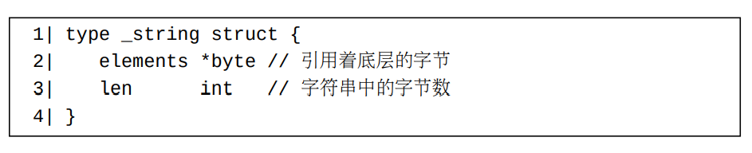
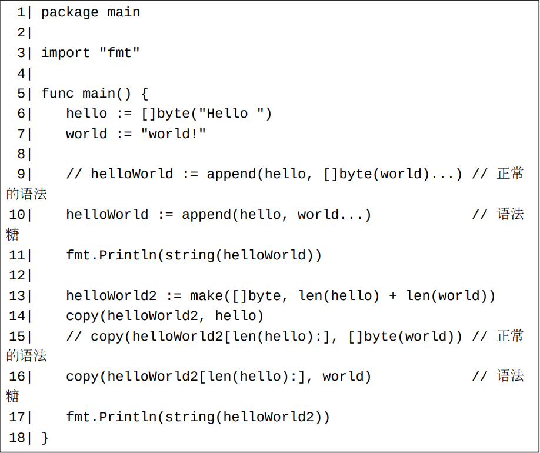
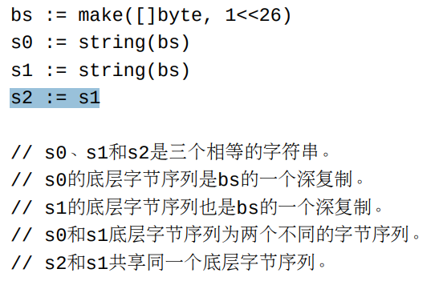

# 字符串类型的内部结构定义

对于标准编译器，字符串类型的内部结构声明如下：

# 关于字符串的一些简单事实

从前面的若干文章，我们已经了解到下列关于字符串的一些事实：
- 字符串值（和布尔以及各种数值类型的值）可以被用做常量。
- Go支持两种风格的字符串字面量表示形式：双引号风格（解释型字面表示）和反引号风格（直白字面表示）。具体介绍请阅读前文（第6章）。字符串类型的零值为空字符串。一个空字符串在字面上可以用""或者``来表示。
- 我们可以用运算符+和+=来衔接字符串。
- 字符串类型都是可比较类型。同一个字符串类型的值可以用==和!=比较运算符来比较。 并且和整数/浮点数一样，同一个字符串类型的值也可以用>、<、>=和<=比较运算符来比较。 当比较两个字符串值的时候，它们的底层字节将逐一进行比较。如果一个字符串是另一个字符串的前缀，并且另一个字符串较长，则另一个字符串为两者中的较大者。

更多关于字符串类型和值的事实：
1. 和Java语言一样，字符串值的内容（即底层字节）是不可更改的。 字符串值的长度也是不可独立被更改的。 一个可寻址的字符串只能通过将另一个字符串赋值给它来整体修改它。
字符串类型没有内置的方法。我们可以
- 使用strings标准库（https://golang.google.cn/pkg/strings/）提供的函数来进行各种字符串操作。调用内置函数len来获取一个字符串值的长度（此字符串中存储的字节数）。
- 使用容器元素索引（第18章）语法aString[i]来获取aString中的第i个字节。 表达式aString[i]是不可寻址的。换句话说，aString[i]不可被修改。
- 使用子切片语法（第18章）aString[start:end]来获取aString的一个子字符串。 这里，start和end均为aString中存储的字节的下标。
2. 对于标准编译器来说，一个字符串的赋值完成之后，此赋值中的目标值和源值将共享底层字节。 一个子切片表达式aString[start:end]的估值结果也将和基础字符串aString共享一部分底层字节。

# 字符串相关的类型转换

在常量和变量（第7章）一文中，我们已经了解到整数可以被显式转换为字符串类型（但是反之不行）。

这里介绍两种新的字符串相关的类型转换规则：
1. 一个字符串值可以被显式转换为一个字节切片（byte slice），反之亦然。一个字节切片类型是一个元素类型为内置类型byte的切片类型。 或者说，一个字节切片类型的底层类型为[]byte（亦即[]uint8）。
2. 一个字符串值可以被显式转换为一个码点切片（rune slice），反之亦然。一个码点切片类型是一个元素类型为内置类型rune的切片类型。 或者说，一个码点切片类型的底层类型为[]rune（亦即[]int32）。

在一个从码点切片到字符串的转换中，码点切片中的每个码点值将被UTF-8编码为一到四个字节至结果字符串中。 如果一个码点值是一个不合法的Unicode码点值，则它将被视为Unicode替换字符（码点）值0xFFFD（Unicode replacementcharacter）。 替换字符值0xFFFD将被UTF-8编码为三个字节0xef 0xbf 0xbd。
当一个字符串被转换为一个码点切片时，此字符串中存储的字节序列将被解读为一个一个码点的UTF-8编码序列。 非法的UTF-8编码字节序列将被转化为Unicode替换字符值0xFFFD

当一个字符串被转换为一个字节切片时，结果切片中的底层字节序列是此字符串中存储的字节序列的一份深复制。 即Go运行时将为结果切片开辟一块足够大的内存来容纳被复制过来的所有字节。当此字符串的长度较长时，此转换开销是比较大的。同样，当一个字节切片被转换为一个字符串时，此字节切片中的字节序列也将被深复制到结果字符串中。 当此字节切片的长度较长时，此转换开销同样是比较大的。在这两种转换中，必须使用深复制的原因是字节切片中的字节元素是可修改的，但是字符串中的字节是不可修改的，所以一个字节切片和一个字符串是不能共享底层字节序列的。
请注意，在字符串和字节切片之间的转换中，
- 非法的UTF-8编码字节序列将被保持原样不变。
- 标准编译器做了一些优化，从而使得这些转换在某些情形下将不用深复制。这样的情形将在下一节中介绍。

Go并不支持字节切片和码点切片之间的直接转换。我们可以用下面列出的方法来实现这样的转换：
- 利用字符串做为中间过渡。这种方法相对方便但效率较低，因为需要做两次深复制。
- 使用unicode/utf8（https://golang.google.cn/pkg/unicode/utf8/）标准库包中的函数来实现这些转换。 这种方法效率较高，但使用起来不太方便。
- 使用bytes标准库包中的Runes函数（https://golang.google.cn/pkg/bytes/#Runes）来将一个字节切片转换为码点切片。 但此包中没有将码点切片转换为字节切片的函数。

# 字符串和字节切片之间的转换的编译器优化

上面已经提到了字符串和字节切片之间的转换将深复制它们的底层字节序列。 标准编译器做了一些优化，从而在某些情形下避免了深复制。 至少这些优化在当前（Go官方工具链1.18）是存在的。 这样的情形包括：

- 一个for-range循环中跟随range关键字的从字符串到字节切片的转换；
- 一个在映射元素读取索引语法中被用做键值的从字节切片到字符串的转换（注意：对修改写入索引语法无效）；
- 一个字符串比较表达式中被用做比较值的从字节切片到字符串的转换；
- 一个（至少有一个被衔接的字符串值为非空字符串常量的）字符串衔接表达式中的从字节切片到字符串的转换。

# 更多字符串衔接方法

除了使用+运算符来衔接字符串，我们也可以用下面的方法来衔接字符串：
- fmt标准库包中的Sprintf/Sprint/Sprintln函数可以用来衔接各种类型的值的字符串表示，当然也包括字符串类型的值。
- 使用strings标准库包中的Join函数。
- bytes标准库包提供的Buffer类型可以用来构建一个字节切片，然后我们可以将此字节切片转换为一个字符串。
- 从Go 1.10开始，strings标准库包中的Builder类型可以用来拼接字符串。和bytes.Buffer类型类似，此类型内部也维护着一个字节切片，但是它在将此字节切片转换为字符串时避免了底层字节的深复制。

标准编译器对使用+运算符的字符串衔接做了特别的优化。 所以，一般说来，在被衔接的字符串的数量是已知的情况下，使用+运算符进行字符串衔接是比较高效的。

# 语法糖：将字符串当作字节切片使用

我们了解到内置函数copy和append可以用来复制和添加切片元素。 事实上，做为一个特例，如果这两个函数的调用中的第一个实参为一个字节切片的话，那么第二个实参可以是一个字符串。 （对于append函数调用，字符串实参后必须跟随三个点...。） 换句话说，在此特例中，字符串可以当作字节切片来使用。

# 更多关于字符串的比较

上面已经提到了比较两个字符串事实上逐个比较这两个字符串中的字节。 Go编译器一般会做出如下的优化：
- 对于==和!=比较，如果这两个字符串的长度不相等，则这两个字符串肯定不相等（无需进行字节比较）。
- 如果这两个字符串底层引用着字符串切片的指针相等，则比较结果等同于比较这两个字符串的长度。

所以两个相等的字符串的比较的时间复杂度取决于它们底层引用着字符串切片的指针是否相等。 如果相等，则对它们的比较的时间复杂度为O(1)，否则时间复杂度为O(n)。

对于标准编译器，一个字符串赋值完成之后，目标字符串和源字符串将共享同一个底层字节序列。 所以比较这两个字符串的代价很小。

