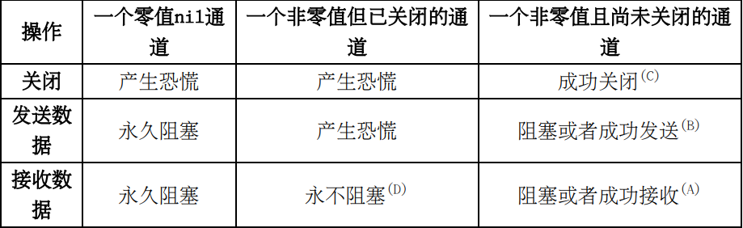

# 通道类型和值

通道可以是双向的，也可以是单向的。
- 字面形式chan T表示一个元素类型为T的双向通道类型。 编译器允许从此类型的值中接收和向此类型的值中发送数据。
- 字面形式chan<- T表示一个元素类型为T的单向发送通道类型。 编译器不允许从此类型的值中接收数据。
- 字面形式<-chan T表示一个元素类型为T的单向接收通道类型。 编译器不允许向此类型的值中发送数据。

双向通道chan T的值可以被隐式转换为单向通道类型chan<- T和<-chan T，但反之不行（即使显式也不行）。 类型chan<- T和<-chan T的值也不能相互转换。

每个通道值有一个容量属性。此属性的意义将在下一节中得到解释。 一个容量为0的通道值称为一个非缓冲通道（unbuffered channel），一个容量不为0的通道值称为一个缓冲通道（buffered channel）。

# 通道值的比较

所有通道类型均为可比较类型。
我们了解到一个通道值可能含有底层部分。 当一个通道值被赋给另一个通道值后，这两个通道值将共享相同的底层部分。 换句话说，这两个通道引用着同一个底层的内部通道对象。 比较这两个通道的结果为true。

# 通道操作

 1. 调用内置函数close来关闭一个通道：
 ``close(ch)``
 传给close函数调用的实参必须为一个通道值，并且此通道值不能为单向接收的。

 2. 使用下面的语法向通道ch发送一个值v：
``ch <- v``
v必须能够赋值给通道ch的元素类型。 ch不能为单向接收通道。 <-称为数据发送操作符。

3.  使用下面的语法从通道ch接收一个值：
``<-ch``
如果一个通道操作不永久阻塞，它总会返回至少一个值，此值的类型为通道ch的元素类型。 ch不能为单向发送通道。 <-称为数据接收操作符，是的它和数据发送操作符的表示形式是一样的。
在大多数场合下，一个数据接收操作可以被认为是一个单值表达式。 但是，当一个数据接收操作被用做一个赋值语句中的唯一的源值的时候，它可以返回第二个可选的类型不确定的布尔值返回值从而成为一个多值表达式。 此类型不确定的布尔值表示第一个接收到的值是否是在通道被关闭前发送的。 （从后面的章节，我们将得知我们可以从一个已关闭的通道中接收到无穷个值。
数据接收操作在赋值中被用做源值的例子：
```
    v = <-ch
    v, sentBeforeClosed = <-ch
```

4. 查询一个通道的容量：
``cap(ch)``
其中cap是一个已经在容器类型（第18章）一文中介绍过的内置函数。 cap的返回值的类型为内置类型int。

5. 查询一个通道的长度：
``len(ch)``

# 通道操作详解

为了让解释简单清楚，在本文后续部分，通道将被归为三类：
1. 零值（nil）通道；
2. 非零值但已关闭的通道；
3. 非零值并且尚未关闭的通道。

下表简单地描述了三种通道操作施加到三类通道的结果。


对于上表中的五种未打上标的情形，规则很简单：
- 关闭一个nil通道或者一个已经关闭的通道将产生一个恐慌
- 向一个已关闭的通道发送数据也将导致一个恐慌。
- 向一个nil通道发送数据或者从一个nil通道接收数据将使当前协程永久阻塞。

下面将详细解释其它四种被打了上标（A/B/C/D）的情形。

为了更好地理解通道和为了后续讲解方便，先了解一下通道类型的大致内部实现是很有帮助的。

我们可以认为一个通道内部维护了三个队列（均可被视为先进先出队列）：

1. 接收数据协程队列（可以看做是先进先出队列但其实并不完全是，见下面解释）。此队列是一个没有长度限制的链表。 此队列中的协程均处于阻塞状态，它们正等待着从此通道接收数据。
2. 发送数据协程队列（可以看做是先进先出队列但其实并不完全是，见下面解释）。此队列也是一个没有长度限制的链表。 此队列中的协程亦均处于阻塞状态，它们正等待着向此通道发送数据。 此队列中的每个协程将要发送的值（或者此值的指针，取决于具体编译器实现）和此协程一起存储在此队列中。
3. 数据缓冲队列。这是一个循环队列（绝对先进先出），它的长度为此通道的容量。此队列中存放的值的类型都为此通道的元素类型。 如果此队列中当前存放的值的个数已经达到此通道的容量，则我们说此通道已经处于满槽状态。如果此队列中当前存放的值的个数为零，则我们说此通道处于空槽状态。 对于一个非缓冲通道（容量为零），它总是同时处于满槽状态和空槽状态。每个通道内部维护着一个互斥锁用来在各种通道操作中防止数据竞争。

每个通道内部维护着一个互斥锁用来在各种通道操作中防止数据竞争。

通道操作情形A： 当一个协程R尝试从一个非零且尚未关闭的通道接收数据的时候，此协程R将首先尝试获取此通道的锁，成功之后将执行下列步骤，直到其中一个步骤的条件得到满足。

1. 如果此通道的缓冲队列不为空（这种情况下，接收数据协程队列必为空），此协程R将从缓冲队列取出（接收）一个值。 如果发送数据协程队列不为空，一个发送协程将从此队列中弹出，此协程欲发送的值将被推入缓冲队列。此发送协程将恢复至运行状态。 接收数据协程R继续运行，不会阻塞。对于这种情况，此数据接收操作为一个非阻塞操作。
2. 否则（即此通道的缓冲队列为空），如果发送数据协程队列不为空（这种情况下，此通道必为一个非缓冲通道）， 一个发送数据协程将从此队列中弹出，此协程欲发送的值将被接收数据协程R接收。此发送协程将恢复至运行状态。接收数据协程R继续运行，不会阻塞。对于这种情况，此数据接收操作为一个非阻塞操作。
3. 对于剩下的情况（即此通道的缓冲队列和发送数据协程队列均为空），此接收数据协程R将被推入接收数据协程队列，并进入阻塞状态。 它以后可能会被另一个发送数据协程唤醒而恢复运行。 对于这种情况，此数据接收操作为一个阻塞操作。

通道操作情形B： 当一个协程S尝试向一个非零且尚未关闭的通道发送数据的时候，此协程S将首先尝试获取此通道的锁，成功之后将执行下列步骤，直到其中一个步骤的条件得到满足。

1. 如果此通道的接收数据协程队列不为空（这种情况下，缓冲队列必为空），一个接收数据协程将从此队列中弹出，此协程将接收到发送协程S发送的值。此接收协程将恢复至运行状态。 发送数据协程S继续运行，不会阻塞。对于这种情况，此数据发送操作为一个非阻塞操作。
2. 否则（接收数据协程队列为空），如果缓冲队列未满（这种情况下，发送数据协程队列必为空）， 发送协程S欲发送的值将被推入缓冲队列，发送数据协程S继续运行，不会阻塞。 对于这种情况，此数据发送操作为一个非阻塞操作。
3. 对于剩下的情况（接收数据协程队列为空，并且缓冲队列已满），此发送协程S将被推入发送数据协程队列，并进入阻塞状态。 它以后可能会被另一个接收数据协程唤醒而恢复运行。 对于这种情况，此数据发送操作为一个阻塞操
作。上面已经提到过，一旦一个非零通道被关闭，继续向此通道发送数据将产生一个恐慌。 注意，向关闭的通道发送数据属于一个非阻塞操作。

通道操作情形C： 当一个协程成功获取到一个非零且尚未关闭的通道的锁并且准备关闭此通道时，下面两步将依次执行：

1. 如果此通道的接收数据协程队列不为空（这种情况下，缓冲队列必为空），此队列中的所有协程将被依个弹出，并且每个协程将接收到此通道的元素类型的一个零值，然后恢复至运行状态。
2. 如果此通道的发送数据协程队列不为空，此队列中的所有协程将被依个弹出，并且每个协程中都将产生一个恐慌（因为向已关闭的通道发送数据）。 这就是我们在上面说并发地关闭一个通道和向此通道发送数据这种情形属于不良设计的原因。 事实上，在数据竞争侦测编译选项（-race）打开时，Go官方标准运行时将很可能会对并发地关闭一个通道和向此通道发送数据这种情形报告成数据竞争。

注意：当一个缓冲队列不为空的通道被关闭之后，它的缓冲队列不会被清空，其中的数据仍然可以被后续的数据接收操作所接收到。详见下面的对情形D的解释。

通道操作情形D： 一个非零通道被关闭之后，此通道上的后续数据接收操作将永不会阻塞。 此通道的缓冲队列中存储数据仍然可以被接收出来。 伴随着这些接收出来的缓冲数据的第二个可选返回（类型不确定布尔）值仍然是true。 一旦此缓冲队列变为空，后续的数据接收操作将永不阻塞并且总会返回此通道的元素类型的零值和值为false的第二个可选返回结果。 上面已经提到了，一个接收操作的第二个
可选返回（类型不确定布尔）结果表示一个接收到的值是否是在此通道被关闭之前发送的。 如果此返回值为false，则第一个返回值必然是一个此通道的元素类型的
零值。

根据上面的解释，我们可以得出如下的关于一个通道的内部的三个队列的各种事实：

- 如果一个通道已经关闭了，则它的发送数据协程队列和接收数据协程队列肯定都为空，但是它的缓冲队列可能不为空。
- 在任何时刻，如果缓冲队列不为空，则接收数据协程队列必为空。
- 在任何时刻，如果缓冲队列未满，则发送数据协程队列必为空。
- 如果一个通道是缓冲的，则在任何时刻，它的发送数据协程队列和接收数据协程队列之一必为空。
- 如果一个通道是非缓冲的，则在任何时刻，一般说来，它的发送数据协程队列和接收数据协程队列之一必为空， 但是有一个例外：一个协程可能在一个select流程控制（#select）中同时被推入到此通道的发送数据协程队列和接收数据协程队列中。

# 通道的元素值的传递都是复制过程

在一个值被从一个协程传递到另一个协程的过程中，此值将被复制至少一次。 如果此传递值曾经在某个通道的缓冲队列中停留过，则它在此传递过程中将被复制两次。 一次复制发生在从发送协程向缓冲队列推入此值的时候，另一个复制发生在接收协程从缓冲队列取出此值的时候。 和赋值以及函数调用传参一样，当一个值被传递时，只有它的直接部分被复制（第17章）。
对于官方标准编译器，最大支持的通道的元素类型的尺寸为65535。 但是，一般说来，为了在数据传递过程中避免过大的复制成本，我们不应该使用尺寸很大的通道元素类型。 如果欲传送的值的尺寸较大，应该改用指针类型做为通道的元素类型。

# for-range应用于通道
for-range循环控制流程也适用于通道。 此循环将不断地尝试从一个通道接收数据，**直到此通道关闭并且它的缓冲队列为空为止**。 和应用于数组/切片/映射的for-range语法不同，应用于通道的for-range语法中最多只能出现一个循环变量，此循环变量用来存储接收到的值。

# select-case分支流程控制代码块

Go中有一个专门为通道设计的select-case分支流程控制语法。 此语法和switch-case分支流程控制语法很相似。 比如，select-case流程控制代码块中也可以有若干case分支和最多一个default分支。 但是，这两种流程控制也有很多不同点。在一个select-case流程控制中，

- select关键字和{之间不允许存在任何表达式和语句。
- fallthrough语句不能被使用.
- 每个case关键字后必须跟随一个通道接收数据操作或者一个通道发送数据操作。 通道接收数据操作可以做为源值出现在一条简单赋值语句中。 以后，一个case关键字后跟随的通道操作将被称为一个case操作
- 所有的非阻塞case操作中将有一个被随机选择执行（而不是按照从上到下的顺序），然后执行此操作对应的case分支代码块。
- 在所有的case操作均为阻塞的情况下，如果default分支存在，则default分支代码块将得到执行； 否则，当前协程将被推入所有阻塞操作中相关的通道的发送数据协程队列或者接收数据协程队列中，并进入阻塞状态。

按照上述规则，一个不含任何分支的select-case代码块select{}将使当前协程处于永久阻塞状态。

# select-case流程控制的实现机理

select-case流程控制是Go中的一个重要和独特的特性。 下面列出了官方标准运行时中select-case流程控制的实现步骤

1. 将所有case操作中涉及到的通道表达式和发送值表达式按照从上到下，从左到右的顺序一一估值。 在赋值语句中做为源值的数据接收操作对应的目标值在此时刻不需要被估值。
2. 将所有分支随机排序。default分支总是排在最后。 所有case操作中相关的通道可能会有重复的。
3. 为了防止在下一步中造成（和其它协程互相）死锁，对所有case操作中相关的通道进行排序。 排序依据并不重要，官方Go标准编译器使用通道的地址顺序进行排序。 排序结果中前N个通道不存在重复的情况。 N为所有case操作中涉及到的不重复的通道的数量。 下面，通道锁顺序是针对此排序结果中的前N个通道来说的，通道锁逆序是指此顺序的逆序。
4. 按照上一步中的生成通道锁顺序获取所有相关的通道的锁。
5. 按照第2步中生成的分支顺序检查相应分支：
   1. 如果这是一个case分支并且相应的通道操作是一个向关闭了的通道发送数据操作，则按照通道锁逆序解锁所有的通道并在当前协程中产生一个恐慌。 跳到第12步。
   2. 如果这是一个case分支并且相应的通道操作是非阻塞的，则按照通道锁逆序解锁所有的通道并执行相应的case分支代码块。 （此相应的通道操作可能会唤醒另一个处于阻塞状态的协程。） 跳到第12步。
   3. 如果这是default分支，则按照通道锁逆序解锁所有的通道并执行此default分支代码块。 跳到第12步。（到这里，default分支肯定是不存在的，并且所有的case操作均为阻塞的。）
6. 将当前协程（和对应case分支信息）推入到每个case操作中对应的通道的发送数据协程队列或接收数据协程队列中。 当前协程可能会被多次推入到同一个通道的这两个队列中，因为多个case操作中对应的通道可能为同一个。
7. 使当前协程进入阻塞状态并且按照通道锁逆序解锁所有的通道。
8. ...，当前协程处于阻塞状态，等待其它协程通过通道操作唤醒当前协程，...
9. 当前协程被另一个协程中的一个通道操作唤醒。 此唤醒通道操作可能是一个通道关闭操作，也可能是一个数据发送/接收操作。 如果它是一个数据发送/接收操作，则（当前正被解释的select-case流程中）肯定有一个相应case操作与之配合传递数据。 在此配合过程中，当前协程将从相应case操作相关的通道的接收/发送数据协程队列中弹出。
10. 按照第3步中的生成的通道锁顺序获取所有相关的通道的锁。
11. 将当前协程从各个case操作中对应的通道的发送数据协程队列或接收数据协程队列中（可能以非弹出的方式）移除。
    1. 如果当前协程是被一个通道关闭操作所唤醒，则跳到第5步。
    2.  如果当前协程是被一个数据发送/接收操作所唤醒，则相应的case分支已经在第9步中知晓。 按照通道锁逆序解锁所有的通道并执行此case分支代码块。
12. 完毕。
