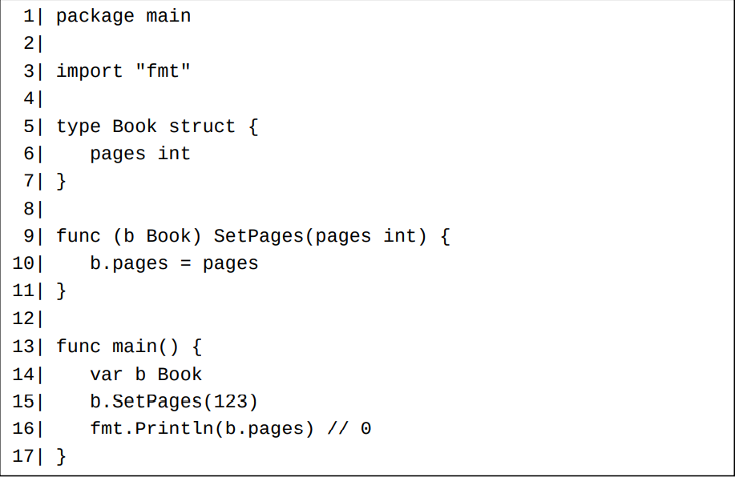

# 方法声明

在Go中，我们可以为类型T和*T显式地声明一个方法，其中类型T必须满足四个条件：
1. T必须是一个定义类型（第14章）；
2. T必须和此方法声明定义在同一个代码包中；
3. T不能是一个指针类型；
4. T不能是一个接口类型。

类型T和\*T称为它们各自的方法的属主类型（receiver type）。 类型T被称作为类型T和*T声明的所有方法的属主基类型（receiver base type）。

注意：我们也可以为满足上列条件的类型T和\*T的别名（第14章）声明方法。 这样做的效果和直接为类型T和*T声明方法是一样的。

如果我们为某个类型声明了一个方法，以后我们可以说此类型拥有此方法。

从上面列出的条件，我们得知我们不能为下列类型（显式地）声明方法：
- 内置基本类型。比如int和string。 因为这些类型声明在内置builtin标准包中，而我们不能在标准包中声明方法。
- 接口类型。但是接口类型可以拥有方法。详见下一篇文章（第23章）。
- 除了满足上面条件的形如*T的指针类型之外的无名组合类型。
  
一个方法声明和一个函数声明很相似，但是比函数声明多了一个额外的参数声明部分。 此额外的参数声明部分只能含有一个类型为此方法的属主类型的参数，此参数称为此方法声明的属主参数（receiver parameter）。 此属主参数声明必须包裹在一对小括号()之中。 此属主参数声明部分必须处于func关键字和方法名之间。

指针类型的属主参数称为指针类型属主，非指针类型的属主参数称为值类型属主。在大多数情况下，我个人非常反对将指针和值这两个术语用做对立面，但是在这里，我并不反对这么用，原因将在下面谈及。

# 每个方法对应着一个隐式声明的函数

对每个方法声明，编译器将自动隐式声明一个相对应的函数。 比如对于上一节的例子中为类型Book和*Book声明的两个方法，编译器将自动声明下面的两个函数：

在上面的两个隐式函数声明中，它们各自对应的方法声明的属主参数声明被插入到了普通参数声明的第一位。 它们的函数体和各自对应的显式方法的方法体是一样的。

两个隐式函数名Book.Pages和(*Book).SetPages都是aType.MethodName这种形式的。 我们不能显式声明名称为这种形式的函数，因为这种形式不属于合法标识符。这样的函数只能由编译器隐式声明。 但是我们可以在代码中调用这些隐式声明的函数：

# 方法值和方法调用

方法事实上是特殊的函数。方法也常被称为成员函数。 当一个类型拥有一个方法，则此类型的每个值将拥有一个不可修改的函数类型的成员（类似于结构体的字段）。 此成员的名称为此方法名，它的类型和此方法的声明中不包括属主部分的函数声明的类型一致。 一个值的成员函数也可以称为此值的方法。

# 属主参数的传参是一个值复制过程

和普通参数传参一样，属主参数的传参也是一个值复制过程。 所以，**在方法体内对属主参数的直接部分（第17章）的修改将不会反映到方法体外。**

一个例子：

另一个例子：

如果将上例中Modify方法中的两行代码次序调换，那么此方法中的两处修改都不能反映到此方法之外。

这两处修改都不能反映到Modify方法之外的原因是append函数调用将开辟一块新的内存来存储它返回的结果切片的元素。 而此结果切片的前两个元素是属主参数切片的元素的副本。对此副本所做的修改不会反映到Modify方法之外。

# 方法值的正规化

在编译阶段，编译器将正规化各个方法值表达式。简而言之，正规化就是将方法值表达式中的隐式取地址和解引用操作均转换为显式操作。

假设值v的类型为T，并且v.m是一个合法的方法值表达式，

- 如果m是一个为类型*T显式声明的方法，那么编译器将把它正规化(&v).m；
- 如果m是一个为类型T显式声明的方法，那么v.m已经是一个正规化的方法值表达式。
  
假设值p的类型为*T，并且p.m是一个合法的方法值表达式，

- 如果m是一个为类型T显式声明的方法，那么编译器将把它正规化(*p).m；
- 如果m是一个为类型*T显式声明的方法，那么p.m已经是一个正规化的方法值表达式。

# 方法值的估值

假设v.m是一个已经正规化的方法值表达式，在运行时刻，当v.m被估值的时候，属主实参v的估值结果的一个副本将被存储下来以供后面调用此方法值的时候使用。

以下面的代码为例：

- b.Pages是一个已经正规化的方法值表达式。 在运行时刻对其进行估值时，属主实参b的一个副本将被存储下来。 此副本等于b的当前值：Book{pages: 123}，此后对b值的修改不影响此副本值。 这就是为什么调
用f1()打印出123。
- 在编译时刻，方法值表达式p.Pages将被正规化为(\*p).Pages。 在运行时刻，属主实参*p被估值为当前的b值，也就是Book{pages: 123}。 这就是
为什么调用f2()也打印出123。
- p.Pages2是一个已经正规化的方法值表达式。 在运行时刻对其进行估值时，属主实参p的一个副本将被存储下来，此副本的值为b值的地址。 当b被修改后，此修改可以通过对此地址值解引用而反映出来，这就是为什么调用g1()打印出789。
- 在编译时刻，方法值表达式b.Pages2将被正规化为(&b).Pages2。 在运行时刻，属主实参&b的估值结果的一个副本将被存储下来，此副本的值为b值的地址。 这就是为什么调用g2()也打印出789。

一个定义类型不会获取为它的源类型显式声明的方法

# 如何决定一个方法声明使用值类型属主还是指针类型属主？

对于值类型属主还是指针类型属主都可以接受的方法声明，下面列出了一些考虑因素：

- 太多的指针可能会增加垃圾回收器的负担。
- 如果一个值类型的尺寸太大，那么属主参数在传参的时候的复制成本将不可忽略。 指针类型都是小尺寸类型。 关于各种不同类型的尺寸，请阅读值复制代
价（第34章）一文。
- 在并发场合下，同时调用值类型属主和指针类型属主方法比较易于产生数据竞争。
- sync标准库包中的类型的值不应该被复制，所以如果一个结构体类型内嵌（第24章）了这些类型，则不应该为这个结构体类型声明值类型属主的方法。

如果实在拿不定主意在一个方法声明中应该使用值类型属主还是指针类型属主，那么请使用指针类型属主。