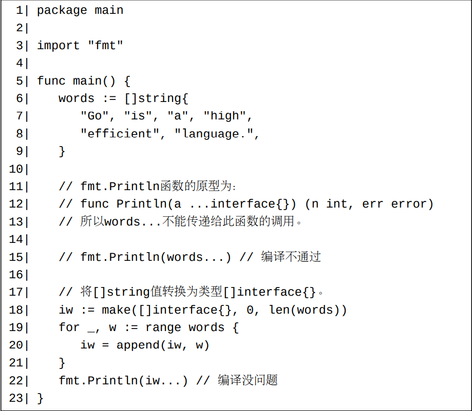

# 接口类型介绍和类型集

一个接口类型定义了一些类型条件。 所有满足了全部这些条件的非接口类型形成了一个类型集合。 此类型集合称为此接口类型的类型集。

接口类型是通过内嵌若干接口元素来定义类型条件的。 目前（Go 1.18）支持两种接口元素：方法元素和类型元素。
- 一个方法元素呈现为一个方法描述（第22章）（method specification）。内嵌在接口类型中的方法描述不能使用空标识符_命名。
- 一个类型元素可以是一个类型名称、一个类型字面表示形式、一个近似类型或者一个类型并集。 本文不过多介绍后两者。对于前两者，也只谈及当它们表
示接口类型的情况。

# 类型断言

Go中有四种接口相关的类型转换情形：

1. 将一个非接口值转换为一个接口类型。在这样的转换中，此非接口值的类型必须实现了此接口类型。
2. 将一个接口值转换为另一个接口类型（前者接口值的类型实现了后者目标接口类型）。
3. 将一个接口值转换为一个非接口类型（此非接口类型必须实现了此接口值的接口类型）。
4. 将一个接口值转换为另一个接口类型（前者接口值的类型未实现后者目标接口类型，但是前者的动态类型有可能实现了目标接口类型）。

一个类型断言表达式的语法为i.(T)，其中i为一个接口值，T为一个类型名或者类型字面表示。 类型T可以为

- 任意一个非接口类型。
- 或者一个任意接口类型。

在一个类型断言表达式i.(T)中，i称为断言值，T称为断言类型。 一个断言可能成功或者失败。

- 对于T是一个非接口类型的情况，如果断言值i的动态类型存在并且此动态类型和T为同一类型，则此断言将成功；否则，此断言失败。 当此断言成功时，此类型断言表达式的估值结果为断言值i的动态值的一个复制。 我们可以把此种情况看作是一次拆封动态值的尝试。
- 对于T是一个接口类型的情况，当断言值i的动态类型存在并且此动态类型实现了接口类型T，则此断言将成功；否则，此断言失败。 当此断言成功时，此类型断言表达式的估值结果为一个包裹了断言值i的动态值的一个复制的T值。
  
一个失败的类型断言的估值结果为断言类型的零值。

按照上述规则，如果一个类型断言中的断言值是一个零值nil接口值，则此断言必定失败。

# 接口值相关的比较

接口值相关的比较有两种情形：

1. 比较一个非接口值和接口值；
2. 比较两个接口值。

对于第一种情形，非接口值的类型必须实现了接口值的类型（假设此接口类型为I），所以此非接口值可以被隐式转化为（包裹到）一个I值中。 这意味着非接口值和接口值的比较可以转化为两个接口值的比较。所以下面我们只探讨两个接口值比较的情形。

比较两个接口值其实是比较这两个接口值的动态类型和和动态值。

下面是（使用==比较运算符）比较两个接口值的步骤：

1. 如果其中一个接口值是一个nil接口值，则比较结果为另一个接口值是否也为一个nil接口值。
2. 如果这两个接口值的动态类型不一样，则比较结果为false。
3. 对于这两个接口值的动态类型一样的情形，
   - 如果它们的动态类型为一个不可比较类型（第48章），则将产生一个恐慌。
   - 否则，比较结果为它们的动态值的比较结果。

简而言之，两个接口值的比较结果只有在下面两种任一情况下才为true：

1. 这两个接口值都为nil接口值。
2. 这两个接口值的动态类型相同、动态类型为可比较类型、并且动态值相等。
   
根据此规则，两个包裹了不同非接口类型的nil零值的接口值是不相等的。

# 一个[\]T类型的值不能直接被转换为类型[]I，即使类型T实现了接口类型I

比如，我们不能直接将一个[\]string值转换为类型[]interface{}。 我们必须使用一个循环来实现此转换

