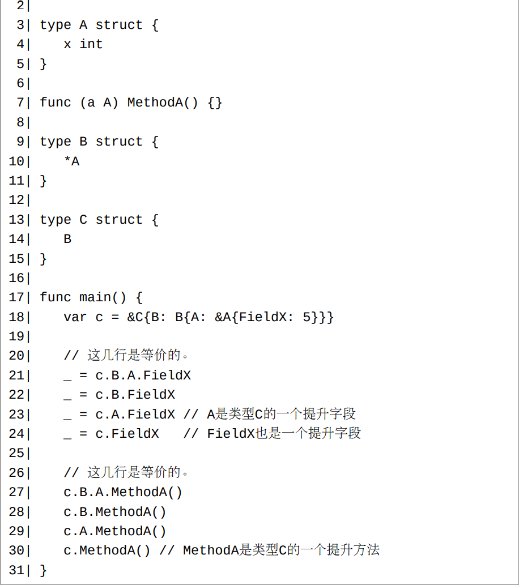

# 类型内嵌的意义是什么？

类型内嵌的主要目的是为了将被内嵌类型的功能扩展到内嵌它的结构体类型中，从而我们不必再为此结构体类型重复实现被内嵌类型的功能。

# 选择器的缩写形式

从前面的结构体（第16章）和方法（第22章）两篇文章中，我们得知，对于一个值x，x.y称为一个选择器，其中y可以是一个字段名或者方法名。 如果y是一个字段名，那么x必须为一个结构体值或者结构体指针值。 一个选择器是一个表达式，它表示着一个值。 如果选择器x.y表示一个字段，此字段也可能拥有自己的字段（如果此字段的类型为另一个结构体类型）和方法，比如x.y.z，其中z可以是一个字段名，也可是一个方法名。

在Go中，（不考虑下面将要介绍的选择器碰撞和遮挡），如果一个选择器中的中部某项对应着一个内嵌字段，则此项可被省略掉。 因此内嵌字段又被称为匿名字段。

# 选择器遮挡和碰撞

一个值x（这里我们总认为它是可寻址的）可能同时拥有多个最后一项相同的选择器，并且这些选择器的中间项均对应着一个内嵌字段。 对于这种情形（假设最后一项为y）：

  - 只有深度最浅的一个完整形式的选择器（并且最浅者只有一个）可以被缩写为x.y。 换句话说，x.y表示深度最浅的一个选择器。其它完整形式的选择器被此最浅者所遮挡（压制）。
  - 如果有多个完整形式的选择器同时拥有最浅深度，则任何完整形式的选择器都不能被缩写为x.y。 我们称这些同时拥有最浅深度的完整形式的选择器发生了碰撞。
  
如果一个方法选择器被另一个方法选择器所遮挡，并且它们对应的方法描述是一致的，那么我们可以说第一个方法被第二个覆盖（overridden）了。