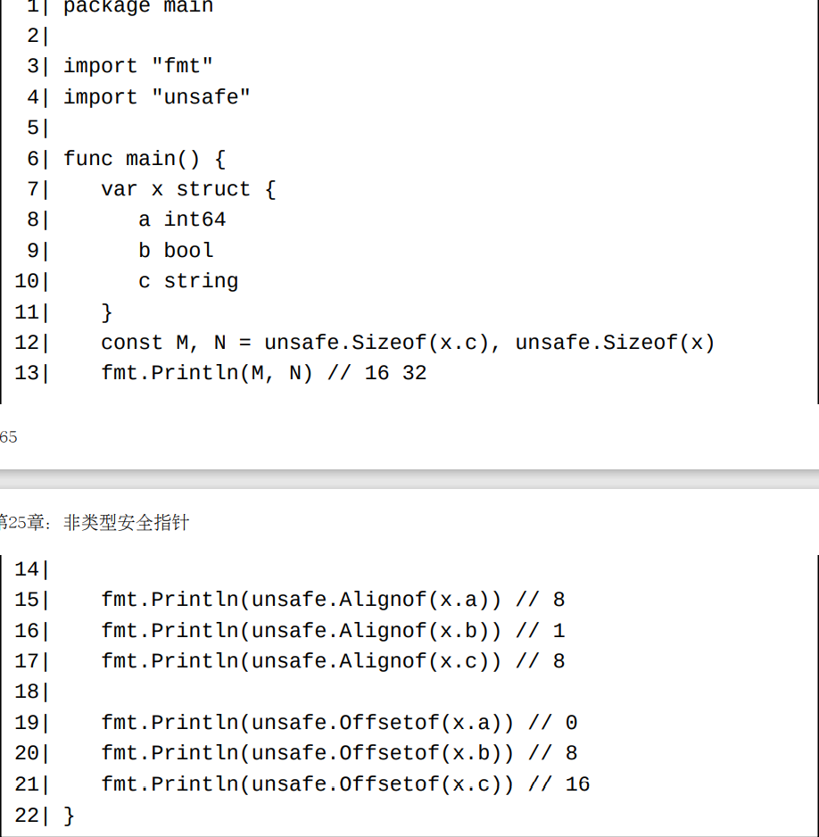

关于unsafe标准库包

非类型安全指针是指底层类型为unsafe.Pointer的类型。

非类型安全指针的零值也使用预声明的nil标识符来表示。

在Go 1.17之前，unsafe标准库包只提供了三个函数：

   - func Alignof(variable ArbitraryType) uintptr。 此函数用来取得一个值在内存中的地址对齐保证（address alignment guarantee）。 注意，同一个类型的值做为结构体字段和非结构体字段时地址对齐保证可能是不同的。 当然，这和具体编译器的实现有关。对于目前的标准编译器，同一个类型的值做为结构体字段和非结构体字段时的地址对齐保证总是相同的。 gccgo编译器对这两种情形是区别对待的。
   - func Offsetof(selector ArbitraryType) uintptr。 此函数用来取得一个结构体值的某个字段的地址相对于此结构体值的地址的偏移。 在一个程序中，对于同一个结构体类型的不同值的对应相同字段，此函数的返回值总是相同的。
   - func Sizeof(variable ArbitraryType) uintptr。 此函数用来取得一个值的尺寸（亦即此值的类型的尺寸）。 在一个程序中，对于同一个类型的不同值，此函数的返回值总是相同的。

注意：

   - 这三个函数的返回值的类型均为内置类型uintptr。下面我们将了解到uintptr类型的值可以转换为非类型安全指针（反之亦然）。
   - 尽管这三个函数之一的任何调用的返回结果在同一个编译好的程序中总是一致的，但是这样的一个调用在不同架构的操作系统中（或者使用不同的编译器编译时）的返回值可能是不一样的。
   - 这三个函数的调用总是在编译时刻被估值，估值结果为类型为uintptr的常量。传递给Offsetof函数的实参必须为一个字段选择器形式value.field。 此选择器可以表示一个内嵌字段，但此选择器的路径中不能包含指针类型的隐式。

