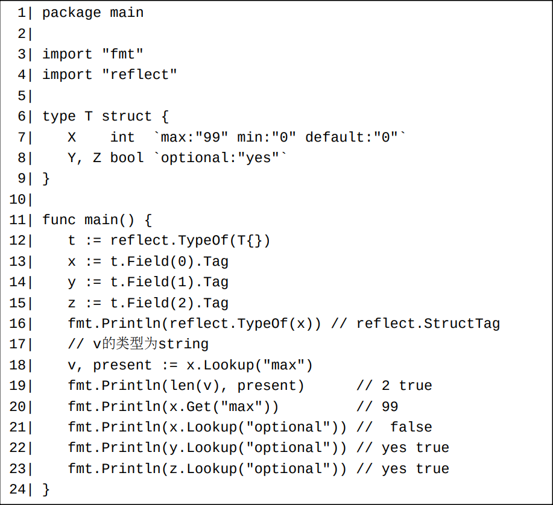
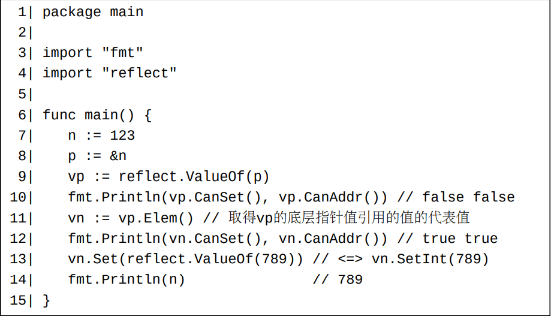
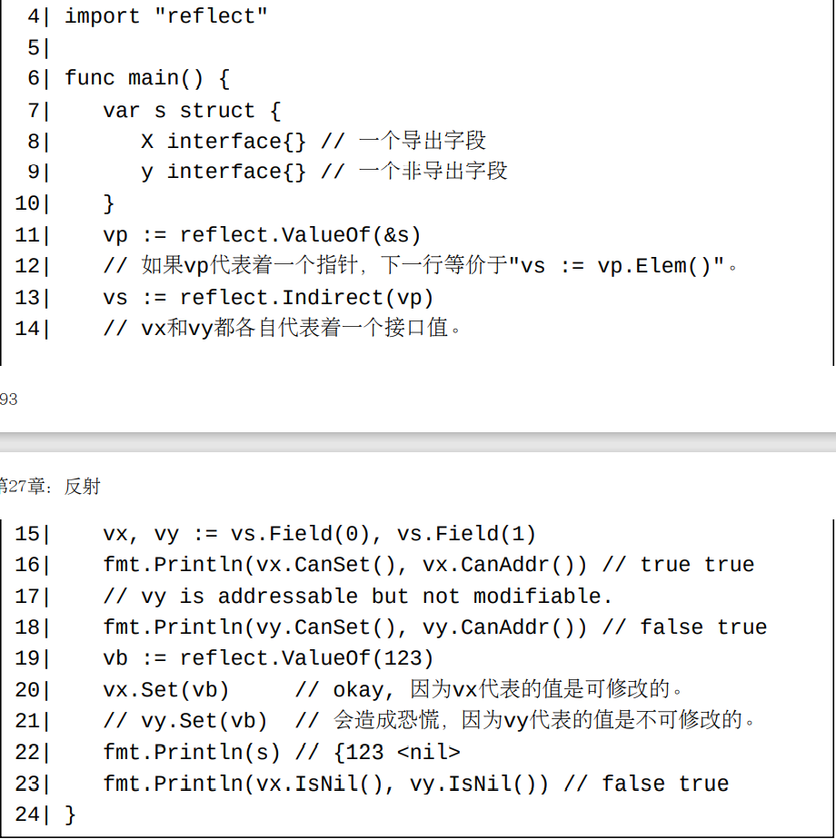
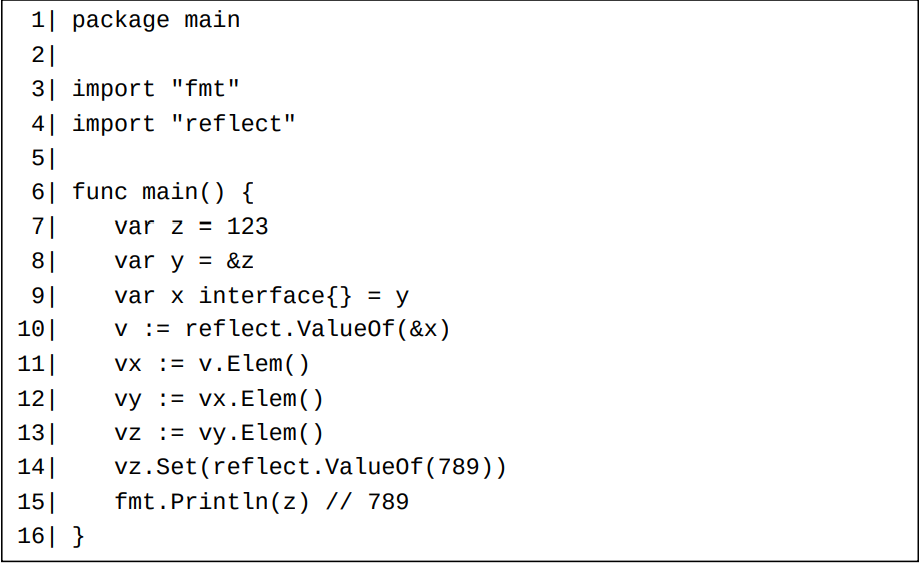
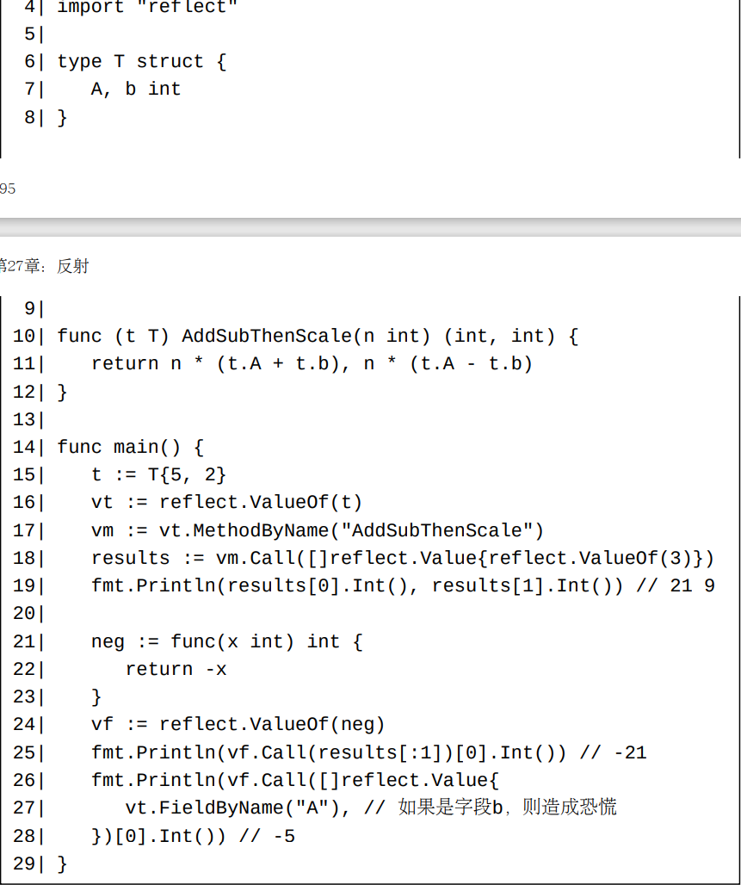
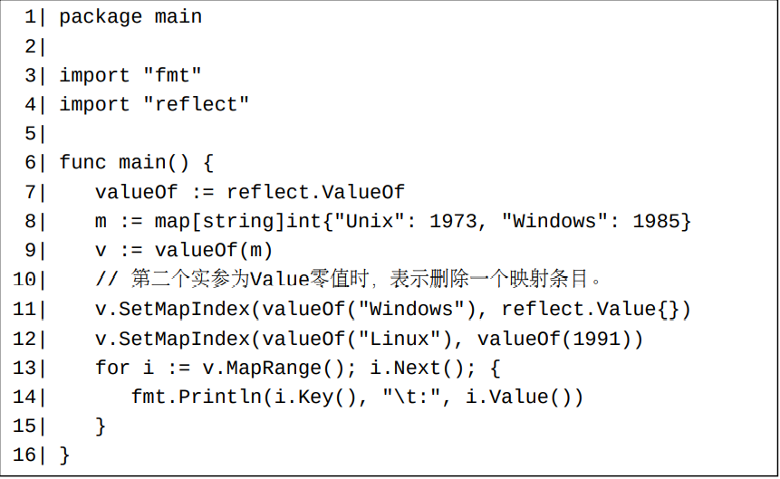
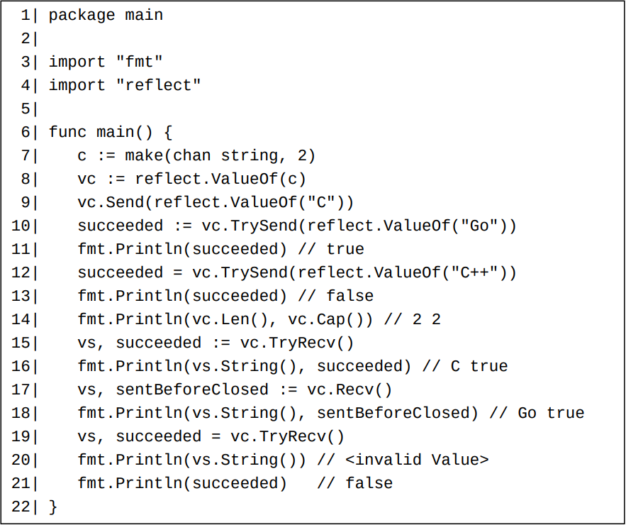
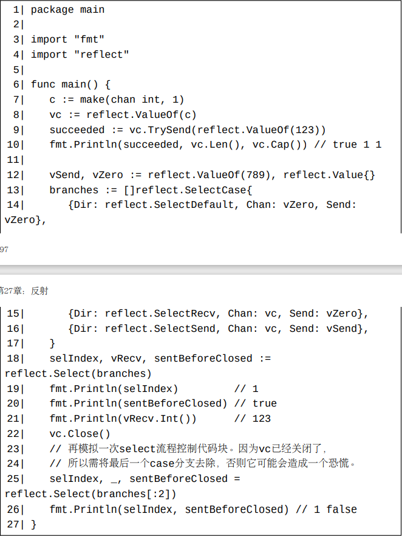
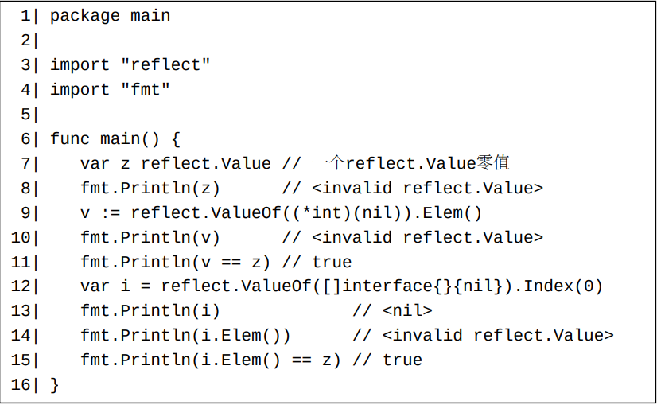

# reflect.Type类型和值

从上面这个例子我们可以看出：
   1. 对于非接口类型，reflect.Type.NumMethod方法只返回一个类型的所有导出的方法（包括通过内嵌得来的隐式方法）的个数，并且 方法reflect.Type.MethodByName不能用来获取一个类型的非导出方法； 而对于接口类型，则并无这些限制（Go 1.16之前的文档对这两个方法的描述不准确，并没有体现出这个差异）。 此情形同样存在于下一节将要介绍的reflect.Value类型上的相应方法。
   2. 虽然reflect.Type.NumField方法返回一个结构体类型的所有字段（包括非导出字段）的数目，但是不推荐（https://golang.org/pkg/reflect/#pkgnote-BUG）使用方法reflect.Type.FieldByName来获取非导出字段。

注意：
   - 键值对中的键不能包含空格（Unicode值为32）、双引号（Unicode值为34）和冒号（Unicode值为58）。
   - 为了形成键值对，所设想的键值对形式中的冒号的后面不能紧跟着空格字符。
    所以
    `optional: "yes"`不形成键值对。
   - 键值对中的值中的空格不会被忽略。所以
    `json:"author, omitempty“`、
    `json:" author,omitempty“`以及
    `json:"author,omitempty“`各不相同。
   - 每个字段标签应该呈现为单行才能使它的整个部分都对键值对的形成有贡献。

注意，到目前为止（Go 1.18），我们无法通过反射动态创建一个接口类型。这是Go反射目前的一个限制。

另一个限制是使用反射动态创建结构体类型的时候可能会有各种不完美的情况出现。

第三个限制是我们无法通过反射来声明一个新的类型。

# reflect.Value类型和值

一个reflect.Value值的CanSet方法将返回此reflect.Value值代表的Go值是否可以被修改（可以被赋值）。 如果一个Go值可以被修改，则我们可以调用对应的reflect.Value值的Set方法来修改此Go值。 注意：reflect.ValueOf函数直接返回的reflect.Value值都是不可修改的。

一个例子：

一个结构体值的非导出字段不能通过反射来修改。

上例中同时也展示了如何间接地获取底层值为接口值的reflect.Value值。

从上两例中，我们可以得知有两种方法获取一个代表着一个指针所引用着的值的reflect.Value值：

   1. 通过调用代表着此指针值的reflect.Value值的Elem方法。
   2. 将代表着此指针值的reflect.Value值的传递给一个reflect.Indirect函数调用。 （如果传递给一个reflect.Indirect函数调用的实参不代表着一个指针值，则此调用返回此实参的一个复制。）
   
注意：reflect.Value.Elem方法也可以用来获取一个代表着一个接口值的动态值的reflect.Value值，比如下例中所示。

如果一个reflect.Value值的底层值为一个函数值，则我们可以调用此reflect.Value值的Call方法来调用此函数。 每个Call方法调用接受一个[]reflect.Value类型的参数（表示传递给相应函数调用的各个实参）并返回一个同类型结果（表示相应函数调用返回的各个结果）。

请注意：非导出结构体字段值不能用做反射函数调用中的实参。 如果上例中的vt.FieldByName("A")被替换为vt.FieldByName("b")，则将产生一个恐慌。

下面是一个使用映射反射值的例子。

下面是一个使用通道反射值的例子。

reflect.Value类型的TrySend和TryRecv方法对应着只有一个case分支和一个default分支的select流程控制代码块（第21章）。

我们可以使用reflect.Select函数在运行时刻来模拟具有不定case分支数量的select流程控制代码块。

一些reflect.Value值可能表示着不合法的Go值。 这样的值为reflect.Value类型的零值（即没有底层值的reflect.Value值）。

从上面的例子中，我们知道，使用空接口interface{}值做为中介，一个Go值可以转换为一个reflect.Value值。 逆过程类似，通过调用一个reflect.Value值的Interface方法得到一个interface{}值，然后将此interface{}断言为原来的Go值。 但是，请注意，调用一个代表着非导出字段的reflect.Value值的Interface方法将导致一个恐慌。