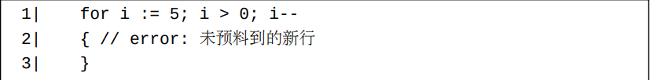
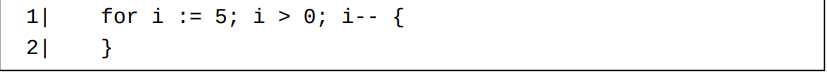
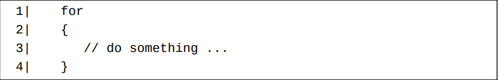
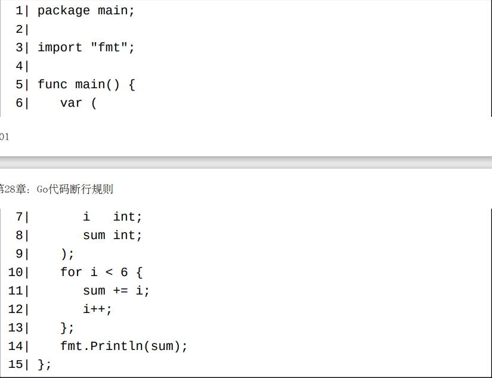
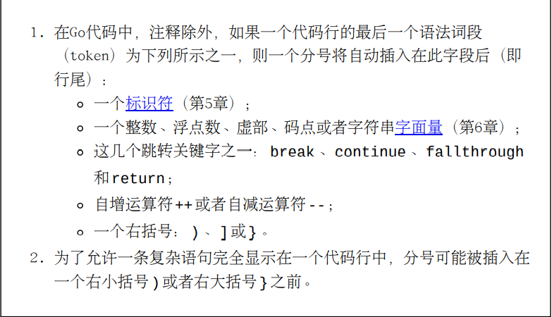
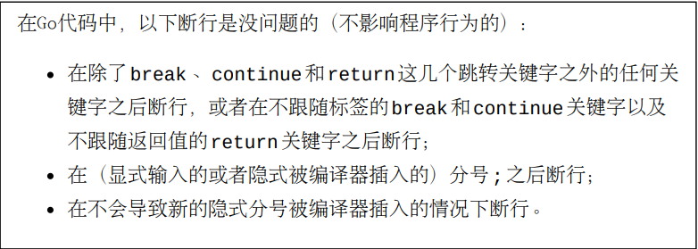

# 分号插入规则

我们在Go编程中常遵循的一个规则是：一个显式代码块的起始左大括号{不放在下一行。 比如，下面这个for循环代码块编译将失败。

为了让上面这个for循环代码块编译成功，我们不能在起始左大括号{前断行，而应该像下面这样进行修改：

然而，有时候起始左大括号{却可以放在一个新行上，比如下面这个for循环代编译时没有问题的。

那么，Go代码中的根本性换行规则究竟是如何定义的呢？ 在回答这个问题之前，我们应该知道一个事实：正式的Go语法是使用（英文）分号;做为结尾标识符的。 但是，我们很少在Go代码中使用和看到分号。为什么呢？原因是大多数分号都是可选的，因此它们常常被省略。 在编译时刻，Go编译器会自动插入这些省略的分号。

比如，下面这个程序中的十个分号都是可以被省略掉的。

假设上面这个程序存储在一个semicolons.go文件中，我们可以运行go fmtsemicolons.go将此程序中的不必要的分号去除掉。 在编译时刻，编译器会自动此插入这些去除掉的分号（至此文件的内存中的版本）。

自动插入分号的规则是什么呢？Go白皮书这样描述

# 逗号,从不会被自动插入

一些包含多个类似项目的语法形式多用逗号,来做为这些项目之间的分割符，比如组合字面量和函数参数列表等。 在这样的一个语法形式中，最后一个项目后总可以跟一个可选的逗号。 如果此逗号为它所在代码行的最后一个有效字符，则此逗号是必需的；否则，此逗号可以省略。 编译器在任何情况下都不会自动插入逗号。

# 结束语

最后，根据上面的解释，在这里描述一下Go代码中的断行规则。

