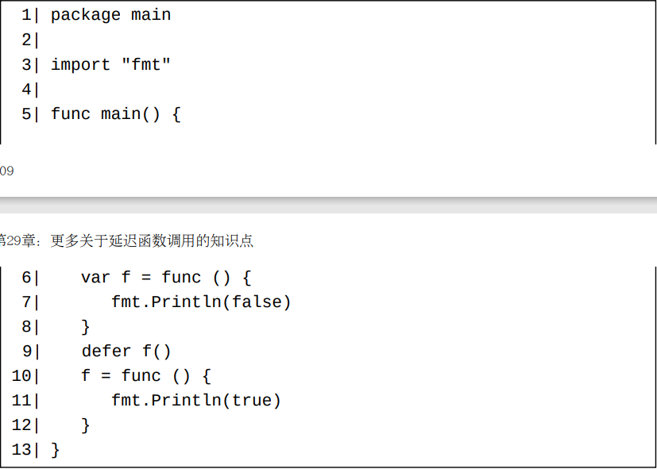
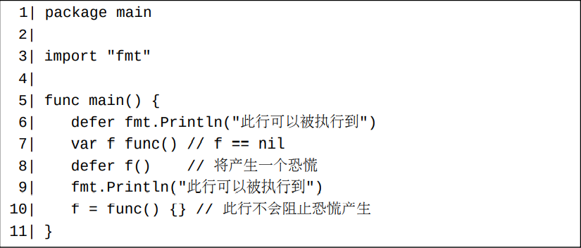
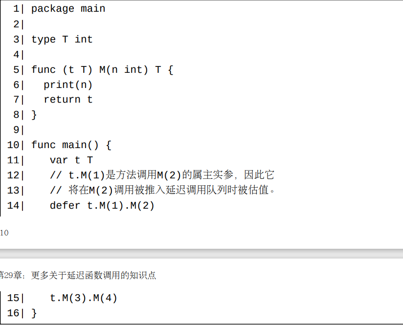
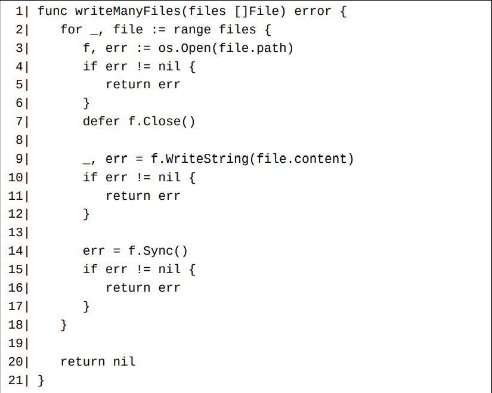
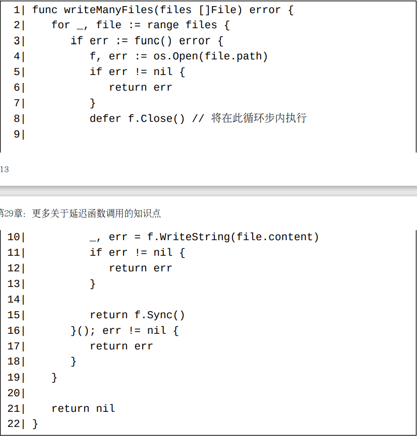

# 很多有返回值的内置函数是不能被延迟调用的

在Go中，**自定义函数的调用的返回结果都可以被舍弃**。 但是，大多数内置函数（除了copy和recover）的调用的返回结果都不可以舍弃（第49章）（至少对于标准编译器1.18来说是如此）。 **另一方面，我们已经了解到延迟函数调用的所有返回结果必须都舍弃掉。 所以，很多内置函数是不能被延迟调用的。**

# 延迟调用的函数值的估值时刻

一个被延迟调用的函数值是在其调用被推入延迟调用队列之前被估值的。 例如，下面这个例子将输出false。

一个被延迟调用的函数值可能是一个nil函数值。这种情形将导致一个恐慌。 对于这种情形，**恐慌产生在此延迟调用被执行而不是被推入延迟调用队列的时候**。 一个例子：

# 延迟方法调用的属主实参的估值时刻

前面的文章曾经解释过：**一个延迟调用的实参也是在此调用被推入延迟调用队列时估值的（第13章）**。 方法的属主实参也不例外。比如，下面这个程序将打印出1342。

# 延迟调用导致的暂时性内存泄露

一个较大的延迟调用队列可能会消耗很多内存。 另外，某些资源可能因为某些调用被延迟的太久而未能被及时释放。

比如，如果下面的例子中的函数需要处理大量的文件，则在此函数退出之前，将有大量的文件句柄得不到释放。

对于这种情形，我们应该使用一个匿名函数将需要及时执行延迟的调用包裹起来。比如，上面的函数可以改进为如下：

