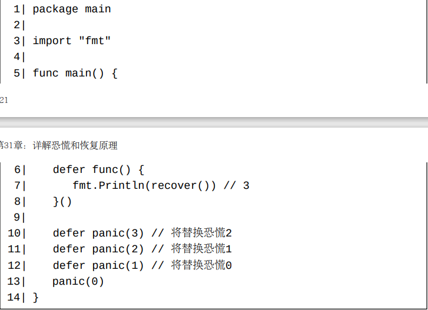
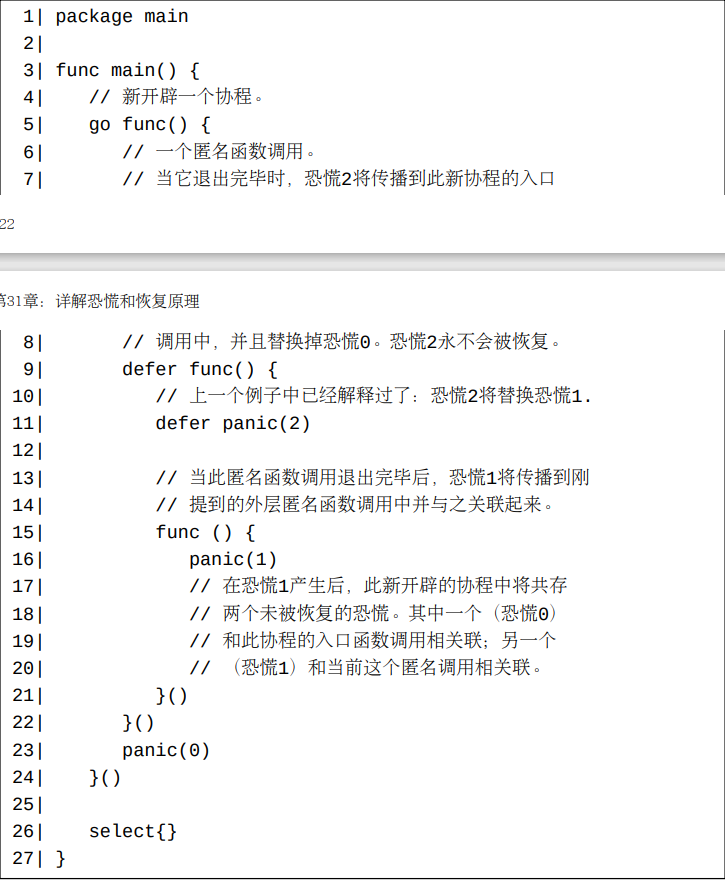
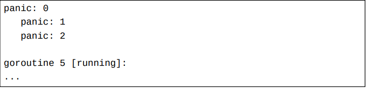
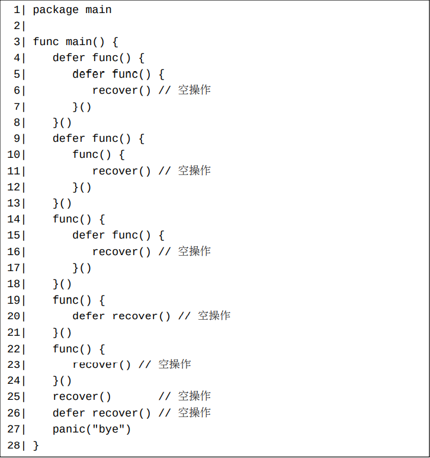
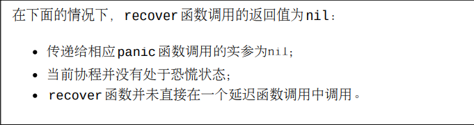
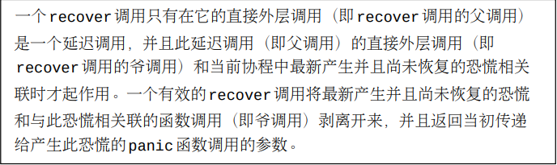

# 函数调用的退出阶段

**在Go中，一个函数调用在其退出完毕之前可能将经历一个退出阶段**。 在此退出阶段，所有在执行此函数调用期间被推入延迟调用队列的延迟函数调用将按照它们的推入顺序的逆序被执行。 当这些延迟函数调用都退出完毕之后，此函数调用的退出阶段也就结束了，或者说此函数调用也退出完毕了，

退出阶段有时候也被称为返回阶段。

一个函数调用可能通过三种途径进入它的退出阶段：

   1. 此调用正常返回；
   2. 当此调用中产生了一个恐慌；
   3. 当runtime.Goexit函数在此调用中被调用并且退出完毕。

# 函数调用关联恐慌和Goexit信号

runtime.Goexit函数，则runtime.Goexit函数返回完毕之后，我们可以认为一个Goexit信号将和此函数调用相关联起来。 恐慌和Goexit信号互相独立于对方，两者互不干扰。 按照上一节中的解释，当一个恐慌或者一个Goexit信号和一个函数调用相关联之后，此函数调用将立即进入它的退出阶段。

我们已经了解到恐慌是可以被恢复的（第13章）。 但是，Goexit信号是不能被取消的。

在任何一个给定时刻，一个函数调用最多只能和一个未恢复的恐慌相关联。 如果一个调用正和一个未恢复的恐慌相关联，则

   - 在此恐慌被恢复之后，此调用将不再和任何恐慌相关联。
   - 当在此函数调用中产生了一个新的恐慌，此新恐慌将替换原来的未被恢复的恐慌做为和此函数调用相关联的恐慌。

在某个时刻，一个协程中可能共存多个未被恢复的恐慌，尽管这在实际编程中并不常见。 **每个未被恢复的恐慌和此协程的调用堆栈中的一个尚未退出的函数调用相关联。 当仍和一个未被恢复的恐慌相关联的一个内层函数调用退出完毕之后，此未被恢复的恐慌将传播到调用此内层函数调用的外层函数调用中。** 这和在此外层函数调用中直接产生一个新的恐慌的效果是一样的。也就是说，

   - 如果此外层函数已经和一个未被恢复的旧恐慌相关联，则传播出来的新恐慌将替换此旧恐慌并和此外层函数调用相关联起来。 对于这种情形，此外层函数调用肯定已经进入了它的退出阶段（刚提及的内层函数肯定就是被延迟调用的），这时延迟调用队列中的下一个延迟调用将被执行。
   - 如果此外层函数尚未和一个未被恢复的旧恐慌相关联，则传播出来的恐慌将和此外层函数调用相关联起来。 对于这种情形，如果此外层函数调用尚未进入它的退出阶段，则它将立即进入。

所以，当一个协程完成完毕后，此协程中最多只有一个尚未被恢复的恐慌。 如果一个协程带着一个尚未被恢复的恐慌退出完毕，则这将使整个程序崩溃，此恐慌信息将在程序崩溃的时候被打印出来。

在一个函数调用被执行的起始时刻，此调用将没有任何恐慌和Goexit信号和它相关联，这个事实和此函数调用的外层调用是否已经进入退出阶段无关。 当然，在此函数调用的执行过程中，恐慌可能产生，runtime.Goexit函数也可能被调用，因此恐慌和Goexit信号以后可能和此调用相关联起来。

下面这个例子程序在运行时将崩溃，因为新开辟的协程在退出完毕时仍带有一个未被恢复的恐慌。

此程序的输出（当使用标准编译器1.18版本编译）：

此输出的格式并非很完美，它容易让一些程序员误认为恐慌0是最终未被恢复的恐慌。而事实上，恐慌2才是最终未被恢复的恐慌。

类似地，当一个和Goexit信号相关联的内层函数调用退出完毕后，此Goexit信号也将传播到外层函数调用中，并和外层函数调用相关联起来。 如果外层函数调用尚未进入退出阶段，则其将立即进入。

# 一些recover调用相当于空操作（No-Op）

内置recover函数必须在合适的位置调用才能发挥作用；否则，它的调用相当于空操作。 比如，在下面这个程序中，没有一个recover函数调用恢复了恐慌bye。

那么为什么本节中的第一个例子中的所有recover调用都不起作用呢？ 让我们先看看当前版本的Go白皮书是怎么说的：

到此我们可以对哪些recover调用会起作用做一个简短的描述：

