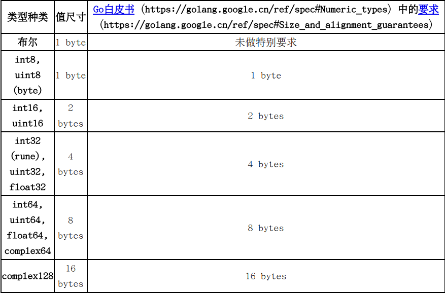

# 值尺寸（value size）

一个值的尺寸表示此值的直接部分（第17章）在内存中占用多少个字节，它的间接部分（如果存在的话）对它的尺寸没有贡献。

在Go中，如果两个值的类型为同一种类（第14章）的类型，并且它们的类型的种类不为字符串、接口、数组和结构体，则这两个值的尺寸总是相等的。

事实上，对于官方标准编译器来说，任**意两个字符串值的尺寸总是相等的，即使它们的字符串类型并不是同一个类型**。 同样地，任意两个接口值的尺寸也都是相等的。

目前（Go 1.18），至少对于官方标准编译器来说，**任何一个特定类型的所有值的尺寸都是相同的。所以我们也常说一个值的尺寸为此值的类型的尺寸。**

一个数组类型的尺寸取决于它的元素类型的尺寸和它的长度。它的尺寸为它的元素类型的尺寸和它的长度的乘积。

一个结构体类型的尺寸取决于它的各个字段的类型尺寸和这些字段的排列顺序。 为了程序执行性能，编译器需要保证某些类型的值在内存中存放时必须满足特定的内存地址对齐（第44章）要求。 地址对齐可能会造成相邻的两个字段之间在内存中被插入填充一些多余的字节。 所以，一个结构体类型的尺寸必定不小于（常常会大于）此结构体类型的各个字段的类型尺寸之和。

下表列出了各种种类的类型的尺寸（对标准编译器1.18来说）。 在此表中，一个word表示一个原生字。在32位系统架构中，一个word为4个字节；而在64位系统架构中，一个word为8个字节。

# 值复制成本

一般说来，**复制一个值的成本正比于此值的尺寸**。 但是，值尺寸并非是值复制成本的唯一决定因素。 不同的CPU型号和编译器版本可能会对某些特定尺寸的值的复制做了优化。

在实践中，**我们可以将尺寸不大于4个原生字并且字段数不超过4个的结构体值看作是小尺寸值**。复制小尺寸值的代价是比较小的。

对于标准编译器，除了大尺寸的结构体和数组类型，其它类型均为小尺寸类型。

为了防止在函数传参和通道操作中因为值复制代价太高而造成的性能损失，我们应该避免使用大尺寸的结构体和数组类型做为参数类型和通道的元素类型，应该在这些场合下使用基类型为这样的大尺寸类型的指针类型。 另一方面，我们也要考虑到太多的指针将会增加垃圾回收的压力。所以到底应该使用大尺寸类型还是以大尺寸类型为基类型的指针类型做为参数类型或通道的元素类型取决于具体的应用场景。

一般来说，在实践中，我们很少使用基类型为切片类型、映射类型、通道类型、函数类型、字符串类型和接口类型的指针类型，因为复制这些类型的值的代价很小。

