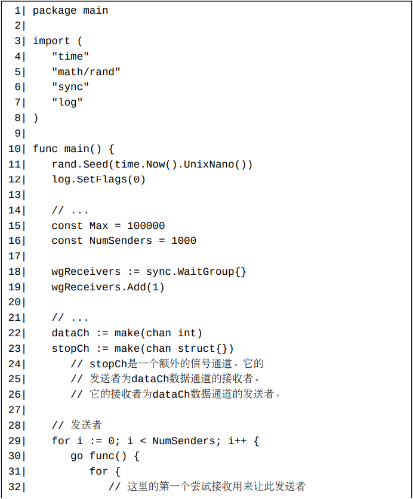

在Go中，如果我们能够保证从不会向一个通道发送数据，那么有一个简单的方法来判断此通道是否已经关闭。

# 通道关闭原则

一个常用的使用Go通道的原则是**不要在数据接收方或者在有多个发送者的情况下关闭通道**。 换句话说，我们只应该让一个通道唯一的发送者关闭此通道。

下面我们将称此原则为**通道关闭原则**。

当然，这并不是一个通用的关闭通道的原则。通用的原则是**不要关闭已关闭的通道**。 

# 粗鲁地关闭通道的方法

如果由于某种原因，你一定非要从数据接收方或者让众多发送者中的一个关闭一个通道，你可以使用恢复机制（第13章）来防止可能产生的恐慌而导致程序崩溃。

同样的方法可以用来粗鲁地向一个关闭状态未知的通道发送数据。

这样的粗鲁方法不仅违反了通道关闭原则，而且Go白皮书和标准编译器不保证它的实现中不存在数据竞争

# 礼貌地关闭通道的方法

很多Go程序员喜欢使用sync.Once来关闭通道。

当然，我们也可以使用sync.Mutex来防止多次关闭一个通道。

这些实现确实比上一节中的方法礼貌一些，但是它们不能完全有效地避免数据竞争。 目前的Go白皮书并不保证发生在一个通道上的并发关闭操作和发送操纵不会产生数据竞争。 **如果一个SafeClose函数和同一个通道上的发送操作同时运行，则数据竞争可能发生**（虽然这样的数据竞争一般并不会带来什么危害）。

# 优雅地关闭通道的方法

## 情形一：M个接收者和一个发送者。发送者通过关闭用来传输数据的通道来传递发送结束信号

## 情形二：一个接收者和N个发送者，此唯一接收者通过关闭一个额外的信号通道来通知发送者不要在发送数据了

此情形比上一种情形复杂一些。我们不能让接收者关闭用来传输数据的通道来停止数据传输，因为这样做违反了通道关闭原则。 但是我们可以让接收者关闭一个额外的信号通道来通知发送者不要在发送数据了。

在此例中，数据通道dataCh并没有被关闭。是的，我们不必关闭它。 当一个通道不再被任何协程所使用后，它将逐渐被垃圾回收掉，无论它是否已经被关闭。

## 情形三：M个接收者和N个发送者。它们中的任何协程都可以让一个中间调解协程帮忙发出停止数据传送的信号

我们可以引入一个中间调解者角色并让其关闭额外的信号通道来通知所有的接收者和发送者结束工作。 具体实现见下例。注意其中使用了一个尝试发送操作来向中间调解者发送信号。

## 情形四：“M个接收者和一个发送者”情形的一个变种：用来传输数据的通道的关闭请求由第三方发出

对于这种情形，我们可以使用一个额外的信号通道来通知唯一的发送者关闭数据通道

