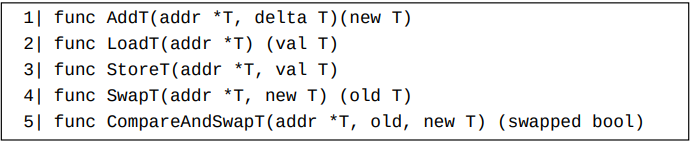
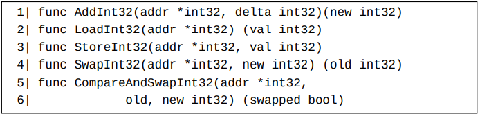
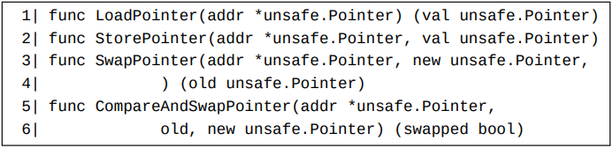
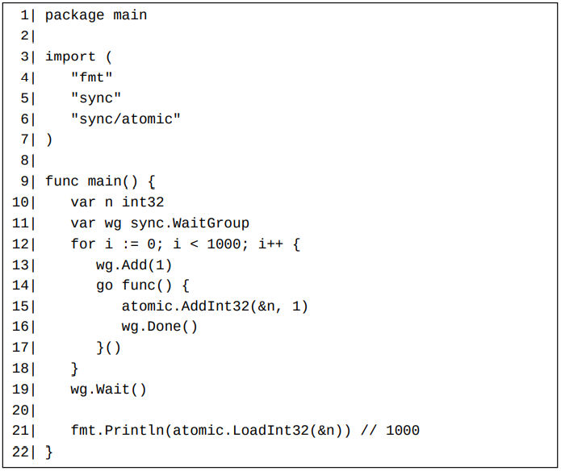
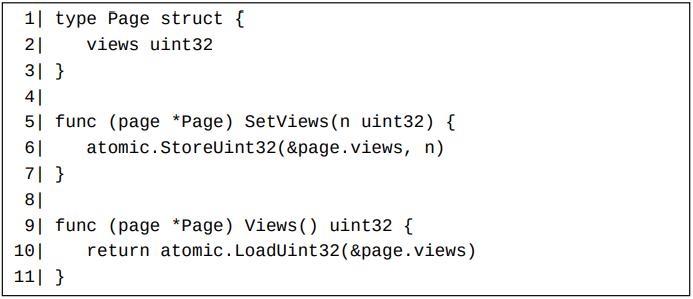

# Go支持的原子操作概述

对于一个整数类型T，sync/atomic标准库包提供了下列原子操作函数。 其中T可以是内置int32、int64、uint32、uint64和uintptr类型。

比如，下列五个原子操作函数提供给了内置int32类型。

下列四个原子操作函数提供给了（安全）指针类型。 因为这几个函数被引入标准库的时候，Go还不支持自定义泛型，所以这些函数是通过非类型安全指针（第25章）unsafe.Pointer来实现的。

sync/atomic标准库包也提供了一个Value类型。以它为基的指针类型*Value拥有两个方法：Load和Store。 Value值用来原子读取和修改任何类型的Go值。

# 整数原子操作

如果我们将新协程中的语句atomic.AddInt32(&n, 1)替换为n++，则最后的输出结果很可能不是1000。

StoreT和LoadT原子操作函数经常被用来需要并发运行的实现setter和getter方法。下面是一个这样的例子

如果T是一个有符号整数类型，比如int32或int64，则AddT函数调用的第二个实参可以是一个负数，用来实现原子减法操作。 但是如果T是一个无符号整数类型，比如uint32、uint64或者uintptr，则AddT函数调用的第二个实参需要为一个非负数，那么如何实现无符号整数类型T值的原子减法操作呢？ 毕竟sync/atomic标准库包没有提供SubstractT函数。 根据欲传递的第二个实参的特点，我们可以把T为一个无符号整数类型的情况细分为两类：

   1. 第二个实参为类型为T的一个变量值v。 因为-v在Go中是合法的，所以-v可以直接被用做AddT调用的第二个实参。
   2. 第二个实参为一个正整数常量c，这时-c在Go中是编译不通过的，所以它不能被用做AddT调用的第二个实参。 这时我们可以使用^T(c-1)（仍为一个正数）做为AddT调用的第二个实参。

SwapT函数调用和StoreT函数调用类似，但是返回修改之前的旧值（因此称为置换操作）。

# 指针值的原子操作

