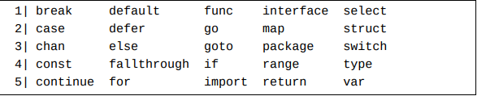

# 关键字

这些关键字可以分为四组：
   - const、func、import、package、type和var用来声明各种代码元素。
   - chan、interface、map和struct用做 一些组合类型的字面表示中。
   - break、case、continue、default、 else、fallthrough、for、goto、if、range、 return、select和switch用在流程控制语句中。详见基本流程控制语法（第12章）。
   - defer和go也可以看作是流程控制关键字， 但它们有一些特殊的作用。详见协程和延迟函数调用（第13章）。

# 标识符

一个标识符是一个以Unicode字母或者_开头并且完全由Unicode字母和Unicode数字组成的单词。

注意：关键字不能被用做标识符。

标识符_是一个特殊字符，它叫做空标识符