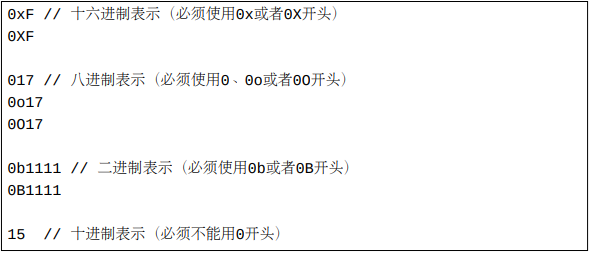

# 基本内置类型

Go支持如下内置基本类型：
   - 一种内置布尔类型：bool。
   - 11种内置整数类型：int8、uint8、int16、uint16、int32、uint32、int64、uint64、int、uint和uintptr。
   - 两种内置浮点数类型：float32和float64。
   - 两种内置复数类型：complex64和complex128。
   - 一种内置字符串类型：string。

内置类型也称为预声明类型。

这17种内置基本类型（type）各自属于一种Go中的类型种类（kind）。 尽管所有的内置基本类型的名称都是非导出标识符（第5章）， 我们可以不用引入任何代码包而直接使用这些类型。

Go中有两种内置类型别名（type alias）：

   - byte是uint8的内置别名。 我们可以将byte和uint8看作是同一个类型。
   - rune是int32的内置别名。 我们可以将rune和int32看作是同一个类型。

任一个类型的所有值的尺寸都是相同的，所以一个值的尺寸也常称为它的类型的尺寸。

一个complex64复数值的实部和虚部都是float32类型的值。 一个complex128复数值的实部和虚部都是float64类型的值。

一个布尔值表示一个真假。在内存中，一个布尔值只有两种可能的状态。 这两种状态**使用两个预声明（或称为内置）的常量（false和true）来表示**。

从逻辑上说，一个字符串值表示一段文本。 在内存中，**一个字符串存储为一个字节（byte）序列**。 此字节序列体现了此字符串所表示的文本的UTF-8编码形式。

尽管布尔和字符串类型分类各自只有一种内置类型， 我们可以声明定义更多自定义布尔和字符串类型。 所以，Go代码中可以出现很多布尔和字符串类型（数值类型也同样）。 下面是一个类型声明的例子。 在这些例子中，type是一个关键字。

# 零值

每种类型都有一个零值。一个类型的零值可以看作是此类型的默认值。

   - 一个布尔类型的零值表示真假中的假。
   - 数值类型的零值都是零（但是不同类型的零在内存中占用的空间可能不同）。
   - 一个字符串类型的零值是一个空字符串。

# 基本类型的字面量表示形式

一个值的字面形式称为一个字面量，它表示此值在代码中文字体现形式（和内存中的表现形式相对应）。一个值可能会有很多种字面量形式。

## 布尔值的字面量形式

Go白皮书没有定义布尔类型值字面量形式。 我们可以将false和true这两个预声明的具名常量当作布尔类型的字面量形式。 但是，我们应该知道，从严格意义上说，它们不属于字面量。具名常量声明将在下一篇文章中介绍和详细解释。

## 整数类型值的字面量形式

整数类型值有四种字面量形式：十进制形式（decimal）、八进制形式（octal）、十六进制形式（hex）和二进制形式（binary）。比如，下面的三个字面量均表示十进制的15：

## 浮点数类型值的字面量形式

一个浮点数的完整十进制字面量形式可能包含一个十进制整数部分、一个小数点、一个十进制小数部分和一个以10为底数的整数指数部分。 整数指数部分由字母e或者E带一个十进制的整数字面量组成（xEn表示x乘以10n的意思，而xE-n表示x除以10n的意思）。 常常地，某些部分可以根据情况省略掉。一些例子：

# 虚部字面量形式

一个虚部值的字面量形式由一个浮点数字面量或者一个整数字面量和其后跟随的一个小写的字母i组成。 在Go 1.13之前，如果虚部中i前的部分为一个整数字面量，则其必须为并且总是被视为十进制形式。 一些例子：

# rune值的字面量形式

rune类型是int32类型的别名。 因此，rune类型（泛指）是特殊的整数类型。 一个rune值可以用上面已经介绍的整数类型的字面量形式表示。 另一方面，很多各种整数类型的值也可以用本小节介绍的rune字面量形式来表示。

**在Go中，一个rune值表示一个Unicode码点。 一般说来，我们可以将一个Unicode码点看作是一个Unicode字符。 但是，我们也应该知道，有些Unicode字符由多个Unicode码点组成。 每个英文或中文Unicode字符值含有一个Unicode码点。**

一个rune字面量由若干包在一对单引号中的字符组成。 包在单引号中的字符序列表示一个Unicode码点值。 rune字面量形式有几个变种，其中最常用的一种变种是将一个rune值对应的Unicode字符直接包在一对单引号中。比如：

下面这些rune字面量形式的变种和'a'是等价的 （字符a的Unicode值是97）。

注意：\之后必须跟随三个八进制数字字符（0-7）表示一个byte值， \x之后必须跟随两个十六进制数字字符（0-9，a-f和A-F）表示一个byte值， \u之后必须跟随四个十六进制数字字符表示一个rune值（此rune值的高四位都为0）， \U之后必须跟随八个十六进制数字字符表示一个rune值。 这些八进制和十六进制的数字字符序列表示的整数必须是一个合法的Unicode码点值，否则编译将失败。

如果一个rune字面量中被单引号包起来的部分含有两个字符， 并且第一个字符是 \，第二个字符不是x、 u和U，那么这两个字符将被转义为一个特殊字符。 目前支持的转义组合为：

# 字符串值的字面量形式

Go字符串的字面量形式有两种。 一种是解释型字面表示（interpreted stringliteral，双引号风格）。 另一种是直白字面表示（raw string literal，反引号风格）。 下面的两个字符串表示形式是等价的：

双引号风格的字符串字面量中支持\"转义，但不支持\'转义；而rune字面量则刚好相反。
