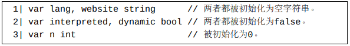

# 类型不确定值（untyped value）和类型确定值（typed value）

在Go中，有些值的类型是不确定的。换句话说，有些值的类型有很多可能性。 这些值称为类型不确定值。对于大多数类型不确定值来说，它们各自都有一个默认类型， 除了预声明的nil。nil是没有默认类型的。

与类型不确定值相对应的概念称为类型确定值。

一个字面（常）量的默认类型取决于它为何种字面量形式：

   - 一个字符串字面量的默认类型是预声明的string类型。
   - 一个布尔字面量的默认类型是预声明的bool类型。
   - 一个整数型字面量的默认类型是预声明的int类型。
   - 一个rune字面量的默认类型是预声明的rune（亦即int32）类型。
   - 一个浮点数字面量的默认类型是预声明的float64类型。
   - 如果一个字面量含有虚部字面量，则此字面量的默认类型是预声明的complex128类型。

# 类型不确定常量的显式类型转换

对于一个类型不确定常量值v，有两种情形显式转换T(v)是合法的：

   1. v可以表示为（第6章）T类型的一个值。 转换结果为一个类型为T的类型确定常量值。
   2. v的默认类型是一个整数类型（int或者rune） 并且T是一个字符串类型。转换T(v)将v看作是一个Unicode码点。 转换结果为一个类型为T的字符串常量。 此字符串常量只包含一个Unicode码点，并且可以看作是此Unicode码点的UTF-8表示形式。 对于不在合法的Unicode码点取值范围内的整数v， 转换结果等同于字符串字面量"\uFFFD"（亦即"\xef\xbf\xbd"）。 0xFFFD是Unicode标准中的（非法码点的）替换字符值。 （但是请注意，今后的Go版本可能只允许rune或者byte整数被转换为字符串（https://github.com/golang/go/issues/3939）。 从Go官方工具链1.15版本开始，go vet命令会对从非rune和非byte整数到字符串的转换做出警告。）

# 类型推断介绍

在Go代码中，如果某处需要一个特定类型的值并且一个类型不确定值可以表示为此特定类型的值， 则此类型不确定值可以使用在此处。

# （具名）常量声明（constant declaration）

和无名字面常量一样，具名常量也必须都是布尔、数字或者字符串值。 在Go中，关键字const用来声明具名常量。 下面是一些常量声明的例子。

Go白皮书把上面每行含有一个等号=的语句称为一个常量描述（constantspecification）。 每个const关键字对应一个常量声明。一个常量声明中可以有若干个常量描述。

常量声明中的等号=表示“绑定”而非“赋值”。 每个常量描述将一个或多个字面量绑定到各自对应的具名常量上。 或者说，每个具名常量其实代表着一个字面常量。

常量可以直接声明在包中，也可以声明在函数体中。 声明在函数体中的常量称为局部常量（local constant），直接声明在包中的常量称为包级常量（package-level constant）。 包级常量也常常被称为全局常量。

上面例子中声明的所有常量都是类型不确定的。 它们各自的默认类型和它们各自代表的字面量的默认类型是一样的。

## 类型确定具名常量

我们可以在声明一些常量的时候指定这些常量的确切类型。 这样声明的常量称为类型确定具名常量。 

## 常量声明中的自动补全

在一个包含多个常量描述的常量声明中，除了第一个常量描述，其它后续的常量描述都可以只有标识符部分。 Go编译器将通过照抄前面最紧挨的一个完整的常量描述来自动补全不完整的常量描述。

自动补全为

## 在常量声明中使用iota

iota是Go中预声明（内置）的一个特殊的具名常量。 iota被预声明为0，但是它的值在编译阶段并非恒定。 当此预声明的iota出现在一个常量声明中的时候，它的值在第n个常量描述中的值为n（从0开始）。 所以iota只对含有多个常量描述的常量声明有意义。

 请阅读代码注释以了解清楚各个常量被绑定的值。

# 变量声明和赋值操作语句

变量可以被看作是在运行时刻存储在内存中并且可以被更改的具名的值。

所有的变量值都是类型确定值。当声明一个变量的时候，我们必须在代码中给编译器提供足够的信息来让编译器推断出此变量的确切类型。

在一个函数体内声明的变量称为局部变量。 在任何函数体外声明的变量称为包级或者全局变量。

Go语言有两种变量声明形式。一种称为标准形式，另一种称为短声明形式。 短声明形式只能用来声明局部变量。

## 标准变量声明形式

每条标准变量声明形式语句起始于一个var关键字。 每个var关键字跟随着一个变
量名。 每个变量名必须为一个标识符（第5章）。

在日常Go编程中，另外两种变种形式用得更广泛一些。 **一种变种形式省略了变量类型（但仍指定了变量的初始值），这时编译器将根据初始值的字面量形式来推断出变量的类型。 另一种变种形式省略了初始值（但仍指定了变量类型），这时编译器将使用变量类型的零值做为变量的初始值。**

下面是一些第一种变种形式的用例。在这些用例中，如果一个初始值是一个类型确定值，则对应声明的变量的类型将被推断为此初始值的类型； 如果一个初始值是一个类型不确定值，则对应声明的变量的类型将被推断为此初始值的默认类型。 注意在这种变种中，同时声明的多个变量的类型可以不一样。

下例展示了几个省略了初始值的标准变量声明。每个声明的变量的初始值为它们各自的类型的零值。

## 纯赋值语句

一个赋值语句等号左边的表达式必须是一个可寻址的值、一个映射元素或者一个空标识符。 

**常量是不可改变的（不可寻址的）**，所以常量不能做为目标值出现在纯赋值语句的左边，而只能出现在右边用做源值。 变量既可以出现在纯赋值语句的左边用做目标值，也可以出现在右边用做源值。

空标识符也可以出现在纯赋值语句的左边，表示不关心对应的目标值。 **空标识符不可被用做源值**。

一个包含了很多（合法或者不合法的）纯赋值语句的例子：

## 短变量声明形式

**每个短声明语句中必须至少有一个新声明的变量。**

从上面的例子中，我们可以看到短变量声明形式和标准变量声明形式有几个显著的区别：

1. 短声明形式不包含var关键字，并且不能指定变量的类型。
2. 短变量声明中的赋值符号必须为:=。
3. 在一个短声明语句的左侧，已经声明过的变量和新声明的变量可以共存。 但在一个标准声明语句中，所有出现在左侧的变量必须都为新声明的变量。

## 若干包级变量在声明时刻的依赖关系将影响它们的初始化顺序

下面这个例子中的声明的变量的初始化顺序为y = 5、c = y、b = c+1、a =b+1、x = a+1。

包级变量在初始化的时候不能相互依赖。比如，下面这个变量声明语句编译不通过。

