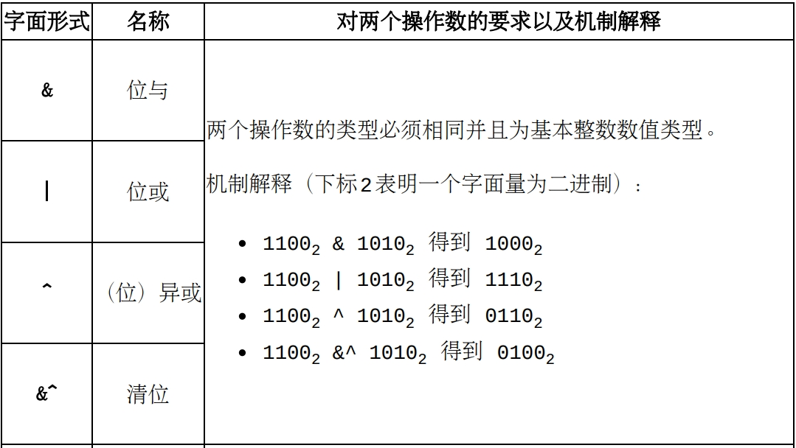
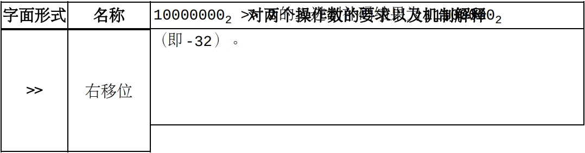

# 常量表达式

 目前我们只需知道本文中所提及的大多数运算都属于表达式。 当一个表达式中涉及到的所有操作数都是常量时，此表达式称为一个常量表达式。 一个常量表达式的估值是在编译阶段进行的。一个常量表达式的估值结果依然是一个常量。 如果一个表达式中涉及到的操作数中至少有一个不为常量，则此表达式称为非常量表达式。

# 算术运算符

Go支持五个基本二元算术运算符：

Go支持六种位运算符（也属于算术运算）：

Go也支持三个一元算术运算符：

#关于溢出

- 一个类型确定数字型常量所表示的值是不能溢出它的类型的表示范围的。
- 一个类型不确定数字型常量所表示的值是可以溢出它的默认类型的表示范围的。 当一个类型不确定数字常量值溢出它的默认类型的表示范围时，此数值不会被截断（亦即回绕）。
- 将一个非常量数字值转换为其它数字类型时，此非常量数字值可以溢出转化结果的类型。 在此转换中，当溢出发生时，转化结果为此非常量数字值的截断（亦即回绕）表示。

#自增和自减操作符
自增（aNumber++）和自减（aNumber--）操作没有返回值，所以它们不能当做表达式（第11章）来使用。 另一个显著区别是，在Go中，自增（++）和自减（--）操作符只能后置，不能前置。

#操作符运算的优先级
Go中的操作符运算的优先级和其它流行语言有一些差别。 下面列出了本文介绍的操作符的优先级。 同一行中的操作符的优先级是一样的。优先级逐行递减。
