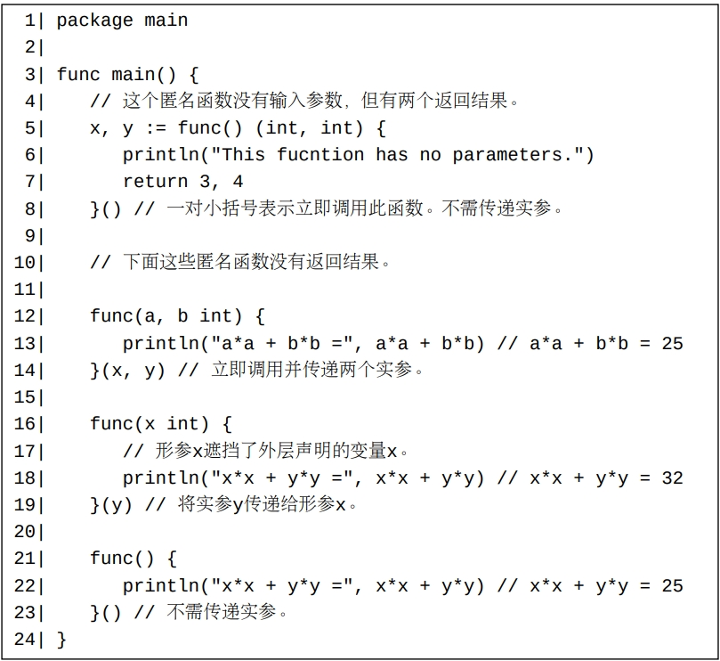

在Go中，所有函数都必须直接声明在包级代码块中。 或者说，任何一个函数都不能被声明在另一个函数体内。 虽然匿名函数（将在下面的某节中介绍）可以定义在函数体内，但匿名函数定义不属于函数声明。

#函数调用的退出阶段
当一个函数调用返回后（比如执行了一个return语句或者函数中的最后一条语句执行完毕）， 此调用可能并未立即退出。一个函数调用从返回开始到最终退出的阶段称为此函数调用的退出阶段（exiting phase）。 

#匿名函数
定义一个匿名函数和声明一个函数类似，但是一个匿名函数的定义中不包含函数名称部分。 注意匿名函数定义不是一个函数声明。

一个匿名函数在定义后可以被立即调用，比如：

注意，上例中的最后一个匿名函数处于变量x和y的作用域内，所以在它的函数体内可以直接使用这两个变量。 这样的函数称为闭包（closure）。事实上，Go中的所有的自定义函数（包括声明的函数和匿名函数）都可以被视为闭包。 