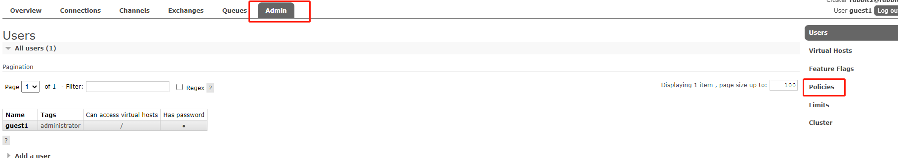
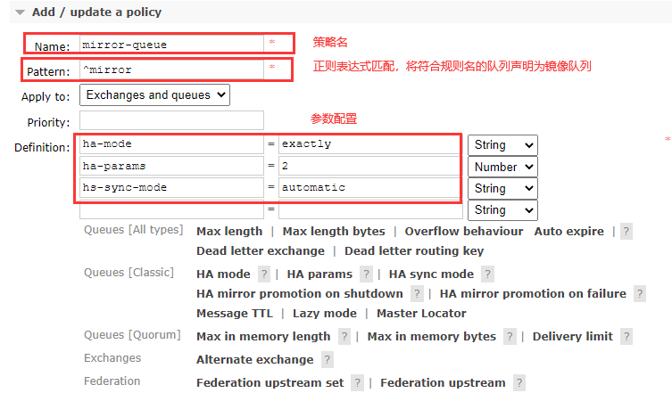
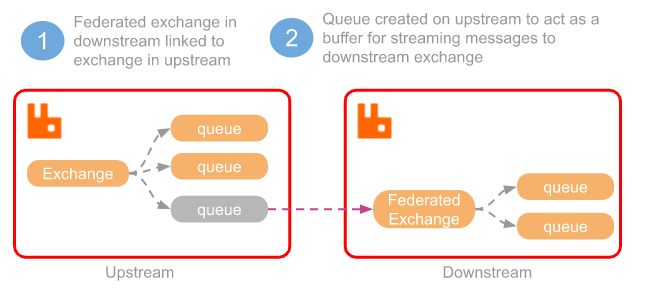
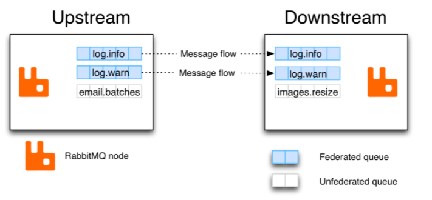
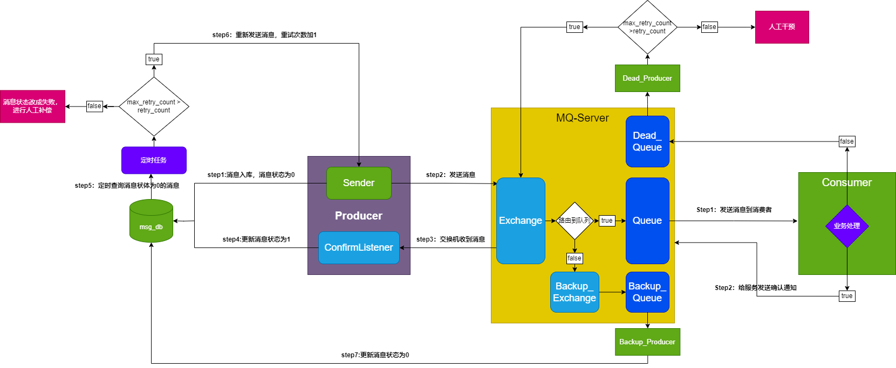

# AMQP协议

### 什么是AMQP

AMQP全称：Advanced Message Queuing Protocol(高级消息队列协议)。是应用层协议的一个开发标准，为面向消息的中间件设计。

### AMQP生产者流转过程


### AMQP消费者流转过程


# RabbitMQ的角色分类

   - 超级管理员（administrator）：可登录管理控制台，可查看所有的信息，并且可以对用户，策略（policy）进行操作；
   - 监控者（monitoring）：可登录管理控制台，同时可以查看rabbitmq节点的相关信息（进程数，内存使用情况，磁盘使用情况等）；
   - 策略制定者（policymaker）：可登录管理控制台，同时可以对policy进行管理。但无法查看节点的相关信息;
   - 普通管理者（management）：仅可登陆管理控制台，无法看到节点信息，也无法对策略进行管理。
   - 其他：无法登录管理控制台，同城就是普通的生产者和消费者；

# RabbitMQ的核心概念

#### Broker
就是server，接受客户端的连接，表示消息队列服务器实体

#### Connection
和具体的Broker的网络连接。

#### Message
消息，消息是不具名的，它由消息头和消息体组成。消息体是不透明的，而消息头则由一系列的可选属性组成，这些属性包括 routing-key（路由键）、 priority（相对于其他消息的优先权）、 delivery-mode（指出该消息可能需要持久性存储）等。

#### Channel
信道， 多路复用连接中的一条独立的双向数据流通道。信道是建立在真实的 TCP 连接内地虚拟连接， AMQP 命令都是通过信道发出去的，不管是发布消息、订阅队列还是接收消息，这些动作都是通过信道完成。因为对于操作系统来说建立和销毁 TCP 都是非常昂贵的开销，所以引入了信道的概念，以复用一条 TCP 连接。客户端可以建立多个channel，每个channel表示一个会话任务。

#### Publisher
消息的生产者，也是一个向交换器发布消息的客户端应用程序。

#### Exchange（将消息路由给队列 ）
交换器，用来接收生产者发送的消息并将这些消息路由给服务器中的队列。

#### Binding（消息队列和交换器之间的关联）
绑定，用于消息队列和交换器之间的关联。一个绑定就是基于路由键将交换器和消息队列连接起来的路由规则，虚拟机根据他来确定如何路由 一条消息，所以可以将交换器理解成一个由绑定构成的路由表。

#### Queue
消息队列，用来保存消息直到发送给消费者。它是消息的容器，也是消息的终点。 一个消息可投入一个或多个队列。消息一直在队列里面，等待消费者连接到这个队列将其取走 。

#### Consumer
消息的消费者，表示一个从消息队列中取得消息的客户端应用程序。

#### Virtual Host
虚拟主机，表示一批交换器、消息队列和相关对象。虚拟主机是共享相同的身份认证和加密环境的独立服务器域。

# RabbitMQ整体架构


# RabbitMQ的运行流程


# RabbitMQ支持消息的模式


# 交换机的模式

交换机可以理解成具有路由表的路由程序，仅此而已。每个消息都有一个称为路由键（routing key）的属性，就是一个简单的字符串。RabbitMQ提供了四种Exchange模式：fanout,direct,topic,header 。 header模式在实际使用中较少，这里只说一下前三种模式.

#### fanout
fanout 模式就是广播模式，这种模式就是所有的消息来了会转发到所有绑定此交换机的队列上，这种模式转发消息是最快的。

#### Direct
Direct这个单词本意就是直接的意思，顾名思义，Direct 模式就是指定队列模式， 消息来了，只发给指定的 Queue, 其他Queue 都收不到，这里是将一个队列绑定到交换机上，要求该消息与一个特定的路由键完全匹配，一对一的匹配才会转发

#### Topic
topic模式，又称主题模式，将路由键和某模式进行匹配。此时队列需要绑定要一个模式上。符号“ # ”匹配一个或多个词，符号“ * ”匹配不多不少一个词。因此“abc.#”能够匹配到“abc.def.xyz”，但是 “ abc. * ” 只会匹配到“abc.def”,一定是规则匹配才会转发。

# 五种模式的简单实现

### Hello World


   - [send.go](https://github.com/rabbitmq/rabbitmq-tutorials/blob/main/go/send.go)

   - [receive.go](https://github.com/rabbitmq/rabbitmq-tutorials/blob/main/go/receive.go)。

### Work Queues


   - [send.go](http://github.com/rabbitmq/rabbitmq-tutorials/blob/main/go/new_task.go)
   - [receive.go](http://github.com/rabbitmq/rabbitmq-tutorials/blob/main/go/worker.go)

### Publish/Subscribe


   - [send.go](http://github.com/rabbitmq/rabbitmq-tutorials/blob/main/go/emit_log.go)
   - [receive.go](http://github.com/rabbitmq/rabbitmq-tutorials/blob/main/go/receive_logs.go)

### Routing


   - [send.go](https://github.com/rabbitmq/rabbitmq-tutorials/blob/main/go/emit_log_direct.go)
   - [receive.go](https://github.com/rabbitmq/rabbitmq-tutorials/blob/main/go/receive_logs_direct.go)

### Topics


   - [send.go](https://github.com/rabbitmq/rabbitmq-tutorials/blob/main/go/emit_log_topic.go)
   - [receive.go](https://github.com/rabbitmq/rabbitmq-tutorials/blob/main/go/receive_logs_topic.go)


# RabbitMQ高级-过期时间TTL

过期时间TTL表示可以对消息设置预期的时间，在这个时间内都可以被消费者接收获取；过了之后消息将自动被删除。RabbitMQ可以对消息和队列设置TTL。目前有三种种方法可以设置。

   - 通过命令行工具

    rabbitmqctl set_policy TTL ".*"  '{"message-ttl":60000}' --apply-to queues

   - 通过队列属性设置，队列中所有消息都有相同的过期时间。

    args := make(map[string]interface{})
    args["x-message-ttl"] =  60000
    channel.queueDeclare( "myqueue" , false , false , false , args)

   - 对消息进行单独设置，每条消息TTL可以不同。

    channel.PublishWithContext(
		ctx,
		exchange,
		//要设置
		routerKey,
		true,
		false,
		amqp.Publishing{
                ContentType: "text/plain",
                Body:        []byte(message),
                Expiration: "6000",
		})

	return err

如果上述三种方法同时使用，则消息的过期时间以两者之间TTL较小的那个数值为准。消息在队列的生存时间一旦超过设置的TTL值，就称为dead message被投递到死信队列， 消费者将无法再收到该消息。

# RabbitMQ高级-死信队列

DLX，全称为Dead-Letter-Exchange , 可以称之为死信交换机，也有人称之为死信邮箱。当消息在一个队列中变成死信(dead message)之后，它能被重新发送到另一个交换机中，这个交换机就是DLX ，绑定DLX的队列就称之为死信队列。
消息变成死信，可能是由于以下的原因：

   - 消息被拒绝
   - 消息过期
   - 队列达到最大长度

DLX也是一个正常的交换机，和一般的交换机没有区别，它能在任何的队列上被指定，实际上就是设置某一个队列的属性。当这个队列中存在死信时，Rabbitmq就会自动地将这个消息重新发布到设置的DLX上去，进而被路由到另一个队列，即死信队列。
要想使用死信队列，只需要在定义队列的时候设置队列参数 x-dead-letter-exchange 指定交换机即可。

#### 注意

   - 如果设置了队列的TTL，那么消息一旦超过了这个时间就会被丢弃（如果有死信队列会被丢弃到死信队列）
  
   - 如果设置的是消息的TTL，消息过期了不一定马上被抛弃。因为消息是否过期是在即将投递到消费者之前判定的，当队列出现消息积压的情况时，已过期的消息仍然能在队列中存活。


# RabbitMQ高级-延迟队列

延迟队列是用来存放需要在指定时间被处理的元素的队列。如果我们希望一条消息在指定时间到了以后或之前处理，可以使用延迟队列。

延迟队列常见的使用场景：订单一段时间内未支付则自动取消、预定会议开始前十分钟通知与会人员参加会议。

TTL是RabbitMQ中一个消息或者队列的属性，表明一条消息或者一个队列中所有消息的最大存活时间。单位是ms

如果一条消息设置了TTL属性，或者一条消息进入了设置TTL属性的队列，则这条消息如果在TTL设置的时间内没有被消费，就会成为“死信”。

如果同时配置了消息的TTL和队列的TTL，较小的值会被使用。

### DLX+TTL实现延迟队列

我们可以使用消息和队列的TTL的属性和死信队列，实现延迟队列。思路是将过期队列转发到死信队列，消费者只要消费死信队列中的消息即可，就实现了延迟队列的功能。

比较队列TTL和消息TTL两种方式:

   - 队列设置TTL属性实现延迟队列，这种方式中，当队列到了过期时间，一定会被放到死信队列。但是这种方式不够灵活，如果想要改变延迟时间，就需要新建队列，面对大量不同时间需求，无法实现。

   - 消息设置TTL属性实现延迟队列，这种方式足够灵活，可以满足任意的延迟时间的需求。但是这种方式的严重缺陷是如果队列中消息积压，会导致过期的消息无法被丢弃（放到死信队列），导致死信队列的消费者无法按时收到消息。

    比如，如果第一个消息的过期时间较长，第二个消息的过期时间较短，
    则两个消息如果先后发送，会同时被消费者收到。
    因为RabbitMQ只检查当前第一个消息，直到等到第一个消息到了TTL时间，
    才会被死信队列收到，然后第二个消息被处理。

    正确的结果应该是根据消息的TTL，第二个消息先到达。

为了解决TTL消息的这种缺陷，我们可以使用插件实现延迟队列，满足不同延迟时间的需求。

### RabbitMQ插件实现延迟队列

#### 安装插件

```rabbitmq_delayed_message_exchange```插件正是为了解决TTL消息无法及时死亡的问题。

在https://www.rabbitmq.com/community-plugins.html 地址下载插件并安装。

下载完以后，将.ez后缀的文件复制到```usr/lib/rabbitmq/lib/rabbitmq_server-3.x.x/plugins```目录，这个目录用于存放RabbitMQ的插件。

进入到这个目录，然后执行语句：

```rabbitmq-plugins enable rabbitmq_delayed_message_exchange```

即可安装插件。

安装成功以后，在web管理界面，添加交换机可以看到新增的```x-delayed-message```类型。

#### 实现原理

如图，使用插件实现延迟队列的原理是创建一个类型为```x-delayed-message```的交换机（延迟交换机），这个类型的交换机支持延迟投递机制，即消息传递到以后先暂存到mnesia表中，到达指定的延迟时间以后才将消息投递出去。

如图，使用插件实现延迟队列的原理是创建一个类型为```x-delayed-message```的交换机（延迟交换机），这个类型的交换机支持延迟投递机制，即消息传递到以后先暂存到mnesia表中，到达指定的延迟时间以后才将消息投递出去。


# RabbitMQ高级-发布确认

发布确认用于确保消息的可靠投递，如果消息投递成功，返回确认信息，如果投递失败，返回失败信息并确保消息不会丢失。

#### 发布确认

发布确认的回调方法可以判断出交换机是否收到消息，当交换机宕机或其他原因导致交换机没有收到生产者发出的消息时，回调方法能够做出反馈。

##### 单个确认发布
单个确认发布，即对每一条消息进行同步确认，生产者发布一条消息后只有它被确认发布后，后续的消息才能继续发布。

##### 批量确认发布
批量确认发布是指根据批次大小确认发布，这种方式的缺点是当发生故障导致发布出现问题时，不知道哪个消息出问题。

##### 异步确认发布
异步确认发布是效率和可靠性最高的。对于已确认消息和未确认消息，异步确认方式都能够处理。

异步确认发布主要是通过addConfirmListener方法监听确认和未确认的消息，使用哈希表记录所有发布的消息，对于成功确认的消息从哈希表中删除，剩下的是未确认的消息。

创建信道，配置异步通道

   ```
   ch, err := conn.Channel()

	if err != nil {
		return err
	}

	// 异步确认消息
	err = ch.Confirm(false)

	if err != nil {
		return err
	}

	confirms := ch.NotifyPublish(make(chan amqp.Confirmation, 1))
   ```

生产者代码

   生产者代码可以指定消息id，即回调接口中消息的id。

   ```
   //2.发送消息
   err = c.Ch.PublishWithContext(
      ctx,
      exchange,
      //要设置
      routerKey,
      true,
      false,
      amqp.Publishing{
         ContentType: "text/plain",
         Body:        []byte(message),
      })

   return err
   ```

实现回调接口

   ```
   func (c *Connection) NotifyAck(confirms chan amqp.Confirmation) {

      for ack := range confirms {
         if ack.Ack {
            fmt.Printf("confirmed delivery with delivery tag: %d", ack.DeliveryTag)
         } else {
            fmt.Printf("confirmed delivery of delivery tag: %d", ack.DeliveryTag)
         }
      }
   }
   ```
**如果只开启发布确认模式的话，当交换机收到生产者发送的消息后，会发布确认消息给生产者，如果发现路由不通，则会直接丢弃消息，此时生产者处于不知情状态，就会造成消息丢失。**

#### 回退消息

回退消息用在消息无法被路由（队列宕机）的情况。

   ```
   returnChan := c.Ch.NotifyReturn(make(chan amqp.Return, 1))

	go func() {
		for ack := range returnChan {
			g.Log().Info(ctx, fmt.Sprintf("消息消息被回退:消息id:%:%s", ack.MessageId, string(ack.Body)))
		}
	}()
   ```

生产者和消费者的实现并无特殊。当发送的消息无法被路由（比如队列宕机、RoutingKey错误等）时，会调用回退方法。

通过发布确认机制，生产者可以得知消息是否被交换机接收；通过回退消息机制，生产者可以得知消息消息是否被分发到队列中。

### 备份交换机

通过回退消息，我们可以感知到无法被路由的消息，但是只能把消息回退，如果像处理非常复杂。想要处理无法被路由的消息，需要使用备份交换机。

备份交换机可以理解为RabbitMQ中交换机的备胎，当交换机收到一条不可路由消息时，将会把这条消息转发到备份交换机中。通常备份交换机的类型为Fanout，这样就能将不可路由消息广播到所有和它绑定的队列中。

备份交换机除了添加备份队列以外，还可以添加一个报警队列，这样如果有无法被路由的消息，报警队列的消费者可以发出警报信息进行提示。


声明交换机时，设置备份交换机属性
```
   //声明交换机，设置备份交换机
   if err := ch.ExchangeDeclare("history", "direct", true, false, false, true, map[string]interface{}{
      "alternate-exchange": "backup_exchange",
   }); err != nil {
      return err
   }
```

声明备份交换机和队列并绑定

```
   //声明备份交换机
   if err := ch.ExchangeDeclare("backup_exchange", "fanout", true, false, false, true, nil); err != nil {
      return err
   }
   //声明备份交换机的队列
   if _, err := ch.QueueDeclare("backup_quque", true, false, false, true, nil); err != nil {
      return err
   }
   //绑定备份交换机的备份队列
   if err := ch.QueueBind("backup_quque", "", "backup_exchange", true, nil); err != nil {
      return err
   }
```

如果**消息回退**机制和**备份交换机**同时配置，则备份交换机机制优先。因为备份队列收到了消息，理解为消息成功路由。


# RabbitMQ高级-集群

#### 集群搭建

假设有三个个rabbitmq节点，分别为rabbit-1、 rabbit-2、rabbit-3，rabbit-1作为主节点，rabbit-2、rabbit-3作为从节点。

1、修改3台机器的主机名称

将3台机器的主机名分别修改为rabbit-1、rabbit-2、rabbit-3，方便识别。

```
# 在/etc/hostname文件中修改
vim /etc/hostname
```
2、配置各个节点的hosts文件

配置**hosts**文件，确保各个节点能够互相认识对方。
```
vim /etc/hosts
```
在每台主机的/etc/hosts文件中添加三个节点的ip地址和主机名，比如：
```
123.123.123.1 rabbit-1
123.123.123.2 rabbit-2
123.123.123.3 rabbit-3
```
3、确保各个节点的cookie文件相同

在其中一个节点上，比如node1节点上，执行远程复制命令，将本机的cookie文件远程复制到另外两个节点中：
```
scp /var/lib/rabbitmq/.erlang.coolie root@node2:/var/lib/rabbitmq/.erlang.cookie
scp /var/lib/rabbitmq/.erlang.coolie root@node3:/var/lib/rabbitmq/.erlang.cookie
```
4、启动RabbitMQ服务

在每台机器上启动RabbitMQ服务：
```
# detached代表以后台守护进程方式启动
rabbitmq-server start -detached
```
5、将节点加入集群

在node2中执行下列指令，将node2加入到node1的集群：
```
# stop_app表示之关闭RabbitMQ服务，stop则会将Erlang虚拟机也关闭
rabbitmqctl stop_app
rabbitmqctl reset
rabbitmqctl join_cluster rabbit@rabbit-1
rabbitmqctl start_app
```
同理，将node3加入到node2的集群。

6、查看集群状态
```
rabbitmqctl cluster_status
```
7、需要重新设置用户
```
# 添加用户，用户名admin，密码123
rabbitmqctl add_user admin 123
# 设置用户角色
rabbitmqctl set_user_tags admin administrator
# 设置用户权限
rabbitmqctl set_permissions -p "/" admin ".*" ".*" ".*"
```
至此，包括三个节点的集群搭建完成。

如果想要解除集群节点，需要在节点中执行解除指令，比如 在节点1中解除节点2，需要在节点1中执行下面的指令：
```
# node1解除node2节点
rabbitmqctl forget_cluster_node rabbit@rabbit-2
```

#### 镜像队列

镜像队列是指将队列镜像到集群中的其他Broker节点之上，这样当集群中某一节点失效后，队列能够自动切换到镜像中的另一个节点上保证服务的可用性。

和集群保证的可用性不同的是，**集群中某一节点宕机后，其中的队列都不可用了，队列中的消息也无法被消费。而镜像队列能够保证集群中的节点宕机后，队列中的消息也不会丢失。**

搭建步骤

以3个集群节点为例，通过web管理页面创建镜像队列。

1、启动三个集群节点

2、登录网页管理，选择policy



3、添加policy



这样，在其中一个节点上创建一个队列，则其他两个节点都有这个队列的镜像队列。当节点宕机以后，可以继续使用其他节点中的队列，保证了高可用性。

#### 高可用负载均衡

1、使用Haproxy实现负载均衡。

Nginx、lvs、Haproxy之间的区别：http://www.ha97.com/5646.html

假设当前有一个Haproxy服务器，要负责一个3个节点的RabbitMQ集群的负载均衡，需要在Haproxy服务器配置如下：

安装Haproxy：

```
yum -y install haproxy
```

修改**haproxy.cfg**：
```
vim /etc/haproxy/haproxy.cfg
```
修改以下内容，将IP改为集群中节点的IP地址：
```
# 检测心跳频率
server rabbitmq_node1 123.123.123.1:5672 check inter 5000 rise 2 fall 3 weight1
server rabbitmq_node1 123.123.123.2:5672 check inter 5000 rise 2 fall 3 weight1
server rabbitmq_node1 123.123.123.3:5672 check inter 5000 rise 2 fall 3 weight1
```
启动Haproxy：
```
haproxy -f /etc/haproxy/haproxy.cfg
# 查看服务是否启动
ps -ef | grep haproxy
```

访问地址： http://haproxy主机地址:8888/stats

2、Keeplived实现双机热备份

上面只使用了一个Haproxy主机进行负载均衡，如果Haproxy主机宕机，虽然RabbitMQ集群没有故障，但是对于外界客户端来说所有的连接都会断开。为了确保负载均衡服务的可靠性，使用Keepalied做高可用，实现故障转移。

Keepalived能够通过自身健康检查，资源接管功能做双机热备份。

Keepalived实现双机热备的步骤可参考：https://blog.51cto.com/hellocjq/2089450

#### Federation Plugin

Federation插件的目的是在不同集群的Broker之间同步消息。

Federation plugin可以实现Federation Exchange和Federation Queue两种功能。

##### ederation Exchange

比如，位于两个地区（不同集群）的两个交换机，如果需要两个地区的用户访问两个节点速度一致，不会出现A地区用户访问B地区服务器延迟比较高的情况，需要使用
Federation exchange。

将其中一个设置为上游交换机，另一个设置为下游交换机，这样发送到上游交换机的信息会通过federation机制同步到下游交换机。这样下游交换机的消费者访问两个交换机的速度是一致的。



搭建步骤参考：https://www.cnblogs.com/yeyongjian/p/13964161.html

##### Federation Queue

联邦队列可以在多个Broker节点或集群之间，为单个队列提供负载均衡的功能。一个联邦队列可以连接一个或多个上游队列，并从这些上游队列中获取消息以满足本地消费者消费消息的需求。



####  Shovel Plugin

Shovel plugin能够可靠、持续地从一个Broker中的队列（源，source）拉去数据并转发到另一个Broker中的交换器中（目的端，destination）。

源端的队列和目的端的交换机可以同时位于同一个Broker，也可以位于不同的Broker上。

部署方法可以参考官方文档：https://www.rabbitmq.com/shovel.html

# RabbitMQ其他知识点

####幂等性

幂等性(idempotence)指的是用户对同一操作发起的一次请求或多次请求的结果是一致的，不会因为多次点击而产生了副作用。消息重复消费时需要考虑消息的幂等性。

消息重复消费：如果MQ已经把消息发送给了消费者，消费者在返回ack时网络中断，MQ未收到确认消息，会将消息重新发送给其他的消费者，或者再次发送给该消费者，就会造成消息重复消费。

解决方式：

   - 对于消费端，可以使用全局ID或者唯一标识比如时间戳等唯一的id，每次消费时用该id判断该消息是否已消费过。
   - 对于发送端，有两种方式：①唯一ID+指纹码机制（基于业务规则拼接的唯一字符串），查询数据库判断是否重复；②利用redis的原子性，setnx指令天然具有幂等性。
  
#### 优先队列

优先队列可以根据消息的优先级进行消息的分发，优先队列会将队列中的消息按照优先级进行排序，按照优先级从高到低的顺序进行消息的发送，而不考虑消息进入队列的顺序。因此，使用优先级队列需要确保所有消息都发送到队列中以后，消费者才开始消费，确保这些消息能够在队列中排序。

使用优先队列需要满足两个条件：①队列是优先队列；②消息需要设置优先级。

声明优先队列：

```
var params = map[string]interface{}{
   "x-max-priority": 10, //设置队列为优先级队列，且消息的最大优
}
channel.queueDeclare("Q1",true,false,false,params);
```
设置消息的优先级：

```
// 在生产者代码中，设置消息的优先级为5
err := channel.PublishWithContext(
		ctx,
		"ExchangeName",
		"RouterKey",
		true,
		false,
		amqp.Publishing{
			ContentType: "text/plain",
			Body:        []byte(message),
         Priority: 5
		})
```
当不同优先级的消息都进入优先队列以后，优先队列将消息进行排序，然后消费者进行消费，接收到的消息是按照优先级从高到低排列。

#### 惰性队列
RabbitMQ 3.6.0版本引入了惰性队列的概念。惰性队列会尽可能的将消息存入磁盘中，消费者消费到对应的消息时，才会被加载到内存中。

惰性队列的目的是为了能够支持更长的队列，当消费者下线或者宕机等情况导致长时间不能消费消息造成堆积时，惰性队列就发挥作用了。

开启惰性队列：

```
var params = map[string]interface{}{
   "x-queue-mode": "lazy", //设置队列为惰性队列
}
channel.queueDeclare("Q1",false,false,false,params);
```
**x-queue-mode**表示队列的模式，默认为**default**模式，如果想要声明惰性队列，则将其设置为**lazy**模式即可。

在面对大量消息积压的情况下，惰性队列能够占用更少的内存，从而存储更多的消息。


# RabbitMQ消息可靠性流程及注意事项



注意事项：
 
   - 消息先入库成功，再向RabbitMQ发送消息，如果消息投递失败，日志记录并报警，可以用定时任务重新投递消息
   - 定时任务重发，如果超过规定重发次数，将消息状态改为投递失败，则需要人工干预，进行补偿。
   - 如果交换机未能路由到队列，消息回进入到备份交换机，备份队列的消费者，将消息状态重置为失败。
   - 消费者消费消息，成功记录消息并返回ack，失败直接nack（false）消息进入失信队列，死信队列消费者判断消费次数，如果大于规定次数，人工干预，进行补偿。