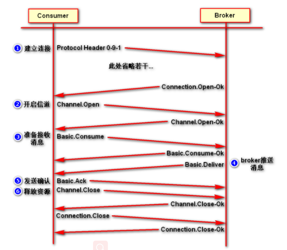

# AMQP协议

### 什么是AMQP

AMQP全称：Advanced Message Queuing Protocol(高级消息队列协议)。是应用层协议的一个开发标准，为面向消息的中间件设计。

### AMQP生产者流转过程

### AMQP消费者流转过程

# RabbitMQ的角色分类

   - 超级管理员（administrator）：可登录管理控制台，可查看所有的信息，并且可以对用户，策略（policy）进行操作；
   - 监控者（monitoring）：可登录管理控制台，同时可以查看rabbitmq节点的相关信息（进程数，内存使用情况，磁盘使用情况等）；
   - 策略制定者（policymaker）：可登录管理控制台，同时可以对policy进行管理。但无法查看节点的相关信息;
   - 普通管理者（management）：仅可登陆管理控制台，无法看到节点信息，也无法对策略进行管理。
   - 其他：无法登录管理控制台，同城就是普通的生产者和消费者；

# RabbitMQ的核心概念

#### Broker
就是server，接受客户端的连接，表示消息队列服务器实体

#### Connection
和具体的Broker的网络连接。

#### Message
消息，消息是不具名的，它由消息头和消息体组成。消息体是不透明的，而消息头则由一系列的可选属性组成，这些属性包括 routing-key（路由键）、 priority（相对于其他消息的优先权）、 delivery-mode（指出该消息可能需要持久性存储）等。

#### Channel
信道， 多路复用连接中的一条独立的双向数据流通道。信道是建立在真实的 TCP 连接内地虚拟连接， AMQP 命令都是通过信道发出去的，不管是发布消息、订阅队列还是接收消息，这些动作都是通过信道完成。因为对于操作系统来说建立和销毁 TCP 都是非常昂贵的开销，所以引入了信道的概念，以复用一条 TCP 连接。客户端可以建立多个channel，每个channel表示一个会话任务。

#### Publisher
消息的生产者，也是一个向交换器发布消息的客户端应用程序。

#### Exchange（将消息路由给队列 ）
交换器，用来接收生产者发送的消息并将这些消息路由给服务器中的队列。

#### Binding（消息队列和交换器之间的关联）
绑定，用于消息队列和交换器之间的关联。一个绑定就是基于路由键将交换器和消息队列连接起来的路由规则，虚拟机根据他来确定如何路由 一条消息，所以可以将交换器理解成一个由绑定构成的路由表。

#### Queue
消息队列，用来保存消息直到发送给消费者。它是消息的容器，也是消息的终点。 一个消息可投入一个或多个队列。消息一直在队列里面，等待消费者连接到这个队列将其取走 。

#### Consumer
消息的消费者，表示一个从消息队列中取得消息的客户端应用程序。

#### Virtual Host
虚拟主机，表示一批交换器、消息队列和相关对象。虚拟主机是共享相同的身份认证和加密环境的独立服务器域。

# RabbitMQ整体架构

# RabbitMQ的运行流程

# RabbitMQ支持消息的模式

# 交换机的模式

交换机可以理解成具有路由表的路由程序，仅此而已。每个消息都有一个称为路由键（routing key）的属性，就是一个简单的字符串。RabbitMQ提供了四种Exchange模式：fanout,direct,topic,header 。 header模式在实际使用中较少，这里只说一下前三种模式.

#### fanout
fanout 模式就是广播模式，这种模式就是所有的消息来了会转发到所有绑定此交换机的队列上，这种模式转发消息是最快的。

#### Direct
Direct这个单词本意就是直接的意思，顾名思义，Direct 模式就是指定队列模式， 消息来了，只发给指定的 Queue, 其他Queue 都收不到，这里是将一个队列绑定到交换机上，要求该消息与一个特定的路由键完全匹配，一对一的匹配才会转发

#### Topic
topic模式，又称主题模式，将路由键和某模式进行匹配。此时队列需要绑定要一个模式上。符号“ # ”匹配一个或多个词，符号“ * ”匹配不多不少一个词。因此“abc.#”能够匹配到“abc.def.xyz”，但是 “ abc. * ” 只会匹配到“abc.def”,一定是规则匹配才会转发。

# 五种模式的简单实现

### Hello World

   - [send.go](https://github.com/rabbitmq/rabbitmq-tutorials/blob/main/go/send.go)

   - [receive.go](https://github.com/rabbitmq/rabbitmq-tutorials/blob/main/go/receive.go)。