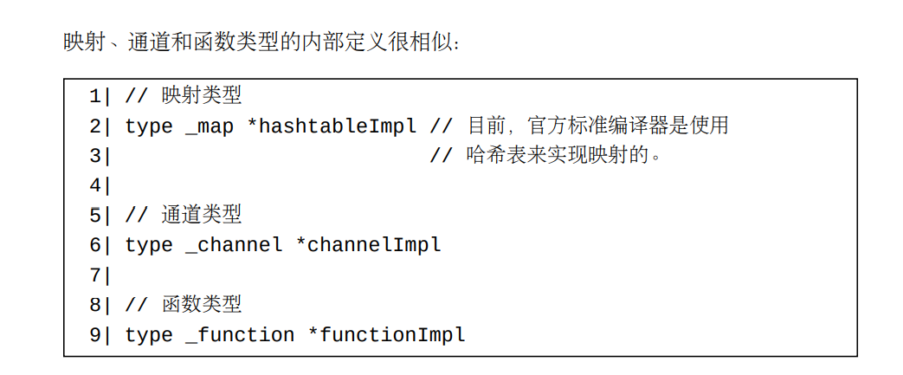

# Go类型分为两大类别
    我们称一个Go值分布在不同内存块上的部分为此值的各个值部（value part）。 一个分布在多个内存块上的值含有一个直接值部和若干被此直接值部引用着（第15章）的间接值部。
    
    下表将列出这两个类别（category）中的类型（type）种类（kind）：
    每个值在内存中只分布在一个内存块上的类型:
    - 布尔类型
    - 各种数值类型
    - 指针类型
    - 非类型安全指针类型
    - 结构体类型
    - 数组类型
    
    每个值在内存中会分布在多个内存块上的类型:

    - 切片类型
    - 映射类型
    - 通道类型
    - 函数类型
    - 接口类型
    - 字符串类型

# 第二个分类中的类型的（可能的）内部实现结构定义

## 映射、通道和函数类型的内部定义

映射、通道和函数类型的内部定义很相似：
